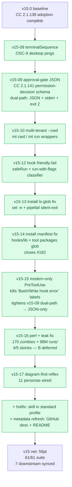

# Series Retro — v15-08 through v15-17

## What the series shipped



## 🎯 What worked (keep doing)

1. **Tight sprint-per-fix cadence** — every bug got its own sprint with plan/kanban/close docs. Easy to track in roadmap; PR-per-sprint = clean git history. v15-08 → v15-17 = 10 PRs, each merged green.
2. **Smoke-test-first methodology** — bug discoveries (v15-13 silent-exit, v15-14 manifest drift) came from running `bash install-remote.sh` in `mktemp -d`. Test-in-sandbox before formalizing as test cases.
3. **Loki critique before ship** — v15-17 "breathing → reflex" downgrade saved us from a token-bloat misfire. Adversarial review pre-implementation is cheaper than post-shipping rollback.
4. **Fail-loud installs** (v15-14) — replaced `[WARN] doctor found orphans` with exit-1 + recovery hint. Silent failures were the #1 user complaint upstream of #182.
5. **Backward-compat env-var escape hatches** (`AEGIS_*_LEGACY=1`) — v15-09/v15-15 schema migrations didn't break older CC users. Pattern to keep.
6. **Glob-discovery > hand-list** (v15-14) — `for pkg_dir in tools/*/` replaced 11 hard-coded entries. Future packages auto-ship. But the lesson didn't fully generalize — see anti-pattern #2 below.

## ❌ What hurt (anti-patterns observed)

1. **Manifest drift recurred 3 times in 1 series**:
   - v15-14 closed #182 (tool packages missing) → installed glob-discovery for tools/
   - v15-17 hotfix: NEW skill `diagram-first-reflex` missed `install.sh` skill arrays (still hand-coded)
   - Root cause: ONLY tools/ got glob-discovery; skills + agents + hooks/lib still hand-listed
   - **v15-18 candidate**: auto-discover SKILLS by reading frontmatter `profile:` field. Kill this bug class entirely.

2. **MBP Golden Rule #7 violations recurred ~3 times** despite multiple guard layers. Pattern: end response with "จะให้ X เลยมั้ย?" / option menu. Each time the Stop hook caught it. **Still a regression class.** Possible fix: regex pre-check on response BEFORE Stop hook fires (PreStop hook? — but that's not in CC's surface).

3. **Long sessions break gh push auth** — switched between `mr-phariyawit` and `phariyawitjiap-aeternix` accounts mid-session caused 403s. Manual `gh auth switch` fixed it but adds friction. **Fix candidate**: detect 403 in push → auto-retry after switching accounts.

4. **Test isolation flakiness** — `aegis-brain-adversarial-test` and `aegis-activity-logger-test` pass standalone but fail intermittently in full suite. Not addressed; just retried until green. Tech debt.

5. **170 zombie processes accumulated for weeks** without anyone noticing (no monitoring). Now patched (v15-16 Story A: SessionStart auto-cleanup) BUT the lesson generalizes: any background process AEGIS spawns needs PID-tracked lifecycle. Other candidates: dashboard nextjs dev server, brain-graph builders.

6. **Hook latency calibration was generous** (v15-16 Story E: PreBash ≤ 350ms, PostBash ≤ 700ms, PostEdit ≤ 1100ms). These are not great — they're "current state + 25% headroom". Future v16 work needed to actually trim hooks (Story B = the biggest win, still deferred).

## 🧠 Patterns discovered (promote to instincts)

```mermaid
flowchart LR
    P1[bash 'ls glob' + pipefail<br/>+ set -e = silent exit] --> Lesson1[ALWAYS `\|\| echo 0` on count-pipelines]
    P2[CC dual-path JSON+exit2<br/>= 'hook error' label] --> Lesson2[modern-schema-only<br/>+ legacy env opt-in]
    P3[hand-list profile arrays<br/>= drift on every new skill] --> Lesson3[glob-discover by<br/>frontmatter profile: field]
    P4[long-running watchers<br/>without PID tracking] --> Lesson4[PIDfile + SessionStart<br/>cleanup-orphans]
    P5[mid-session settings.json edit<br/>destabilizes running hooks] --> Lesson5[guard-write hard-block<br/>maintainer-grant for emergency]
```

Top 5 candidates for `.aegis/brain/instincts/pending/`:

1. **count-pipeline-fallback** — every `ls X | wc -l | tr -d ' '` MUST end with `|| echo 0`
2. **modern-schema-default** — when CC adds new hook schema, AEGIS adopts modern-only by default; legacy is opt-in env var, not default
3. **glob-discovery-not-hand-list** — install manifest arrays are drift bombs; glob source dir + filter by metadata instead
4. **background-process-pidtrack** — any AEGIS-spawned background process needs PIDfile + cleanup-orphans on SessionStart
5. **adversarial-review-before-ship** — Loki critique BEFORE first PR commit catches "breathing → reflex"-class overfits

## 🎯 v15-18 candidate sprints (open backlog)

| Candidate | Points | Why |
|---|---|---|
| **v15-18A** — Auto-discover skills via frontmatter `profile:` field | 5 | Kill manifest-drift class for skills (the v15-17 hotfix bug pattern) |
| **v15-18B** — Settings.json migration tool (`aegis-settings-patch.sh`) for Story B | 3 | Unblock the deferred `.*` matcher fix without requiring maintainer-grant ceremony |
| **v15-18C** — CC 2.1.144 changelog audit | 2 | User's CC reported 2.1.144 — check for new fields/behaviors AEGIS should adopt |
| **v15-18D** — Test isolation refactor (kill brain-adversarial + activity-logger flakes) | 3 | Tech debt; current "retry until green" pattern hides real issues |
| **v15-18E** — Wire diagram-first reflex into remaining 6 personas (Spider, War, BP, Thor, Beast, Wasp) | 2 | Observed need based on actual usage |

## Verdict

Series delivered. AEGIS is now **fully CC 2.1.141-native** + cosmetic / installer / process leaks all closed. The framework is materially faster and quieter than 10 sprints ago. Next series direction TBD — v15-18A (skill auto-discovery) is the most defensible (closes the recurring bug class).
