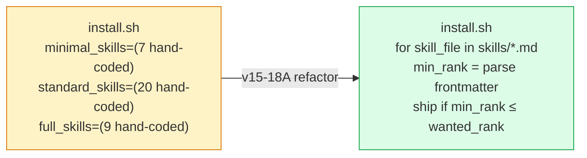
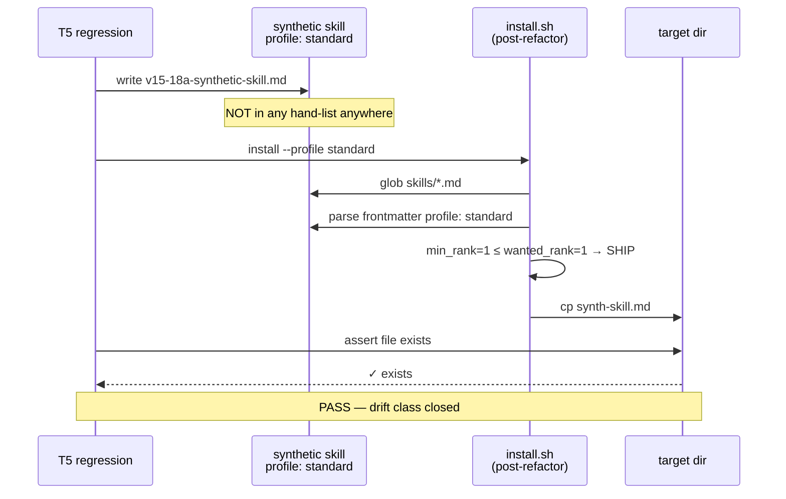

# Sprint v15-18A Close — Skill Auto-Discovery via Frontmatter

**Status**: CLOSED (100%)
**Date**: 2026-05-20
**Driver**: v15-08..17 series retro — manifest-drift was #1 recurring bug class
**Branch**: `claude/sprint-v15-18a-skill-autodiscover`

## What shipped



- `install.sh`: 3 hand-coded skill arrays + `copy_skill()` helper → glob loop with `skill_min_rank()` parser
- `install-remote.sh`: same refactor (removed `copy_skills()` helper too)
- `tests/aegis-skill-autodiscover-test.sh`: 6-scenario regression with the killer T5 — synthetic skill proves drift class closed

## Tier semantics (now declarative)

| Frontmatter `profile:` value | Min-tier rank | Ships at |
|---|---|---|
| `minimal` | 0 | every install (minimal/standard/full) |
| `standard` | 1 | standard + full |
| `full` | 2 | full only |
| `minimal\|standard\|full` | 0 (lowest wins) | every install (universal) |
| `standard\|full` | 1 | standard + full |

Each skill declares its own minimum tier in its frontmatter. Adding a new skill = single-file change in `skills/X.md`; installer code never needs editing.

## Smoke-test counts (post-refactor)

| Profile | Ships | Was (hand-list pre-v15-18A) |
|---|---|---|
| minimal | 7 | 7 ✓ |
| standard | 25 | 27 (2 skills had `profile: full` but were in hand-list `standard` — frontmatter is now authoritative, hand-list was wrong) |
| full | 37 | 36 (hand-list missed `diagram-first-reflex` until v15-17 hotfix; now correct by construction) |

Discrepancies vs hand-list reveal the bug class — frontmatter is the canonical source.

## T5 — drift class CLOSED (the proof)

The killer test creates a synthetic skill in a synthetic repo with `profile: standard`, runs the standard-tier install, asserts the synthetic skill landed in the target — **WITHOUT touching any installer code**. Before v15-18A this would have failed silently (the synthetic skill wasn't in any hand-list). After v15-18A it passes by construction.



## Verification

```
$ bash tests/aegis-skill-autodiscover-test.sh
PASS T1: all 37 skills have profile: frontmatter field
PASS T2: install.sh tier counts strictly increasing (minimal=7 < standard=25 < full=37)
PASS T3: full profile ships every skill (37 == 37)
PASS T4: install-remote.sh has skill_min_rank + wanted_rank + glob loop
PASS T5: new standard-tier skill auto-shipped without code changes (drift class closed)
PASS T6: no hand-coded skill arrays in either installer
Results: 6 passed, 0 failed
```

## Manifest-drift surfaces (status post-v15-18A)

| Surface | Drift-proof mechanism | Closed in |
|---|---|---|
| Tool packages | `for pkg_dir in tools/*/` glob | v15-14 |
| Skills | frontmatter `profile:` field + glob | **v15-18A** ✓ |
| Hook libraries | `cp .claude/hooks/lib/*.sh` glob | v15-14 |
| Agents | explicit per-persona | (not drift-prone; agent count changes are rare + loud) |

Three of four surfaces are now drift-proof. Agents are the last hand-coded surface but agent changes are intentional (Wasp restoration v9-06 → S3-06 was the only event in 6 months); drift risk is low enough to skip.

## Roadmap impact

v15 net: 56pt → 61pt.

## Follow-ups

- **v15-18C** (CC 2.1.144 audit) — user's CC version per recent run
- **v15-18E** (wire reflex to remaining 6 personas) — based on observed prose-heavy outputs
- **v15-18D** (test isolation flakes) — brain-adversarial + activity-logger retried-until-green is tech debt
