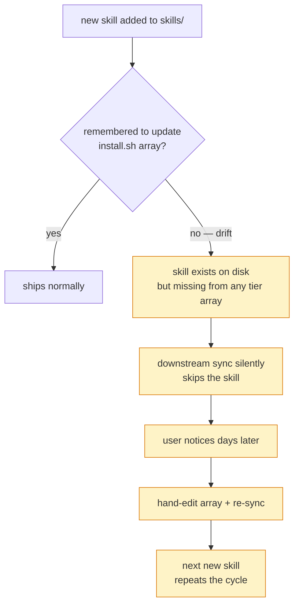

# Sprint v15-18A — Skill Auto-Discovery via Frontmatter

> Kill the manifest-drift bug class **at the architecture level** by
> replacing the hand-coded skill profile arrays in `install.sh` +
> `install-remote.sh` with auto-discovery from each skill's frontmatter
> `profile:` field. Source-of-truth becomes the skill file itself.

## Sprint metadata

- **ID**: sprint-v15-18a-skill-autodiscover
- **Points**: 5
- **Status**: SELECTED
- **Branch**: `claude/sprint-v15-18a-skill-autodiscover`
- **Driver**: v15-08..17 series retro (2026-05-20) identified manifest
  drift as the #1 recurring bug class — v15-14 closed #182 for tool
  packages via glob-discovery, but skill profile arrays remained
  hand-coded. v15-17 hotfix proved the bug still bites: new
  `diagram-first-reflex` skill was added to source but missed the
  install.sh `standard_skills` array, so downstream sync silently
  skipped it.

## Root cause

## Stories

| Story | Pts | Description |
|---|---|---|
| **A — install.sh auto-discovery** | 2 | Replace `minimal_skills/standard_skills/full_skills` arrays with glob over `skills/*.md` + parse frontmatter `profile:` field. Tier semantics: `minimal` (ranks 0) ships at all tiers, `standard` (rank 1) at standard+, `full` (rank 2) at full only, `minimal\|standard\|full` (pipe list) = minimum rank in the list. |
| **B — install-remote.sh same refactor** | 2 | Same logic, applied to the curl-based installer. Glob over `${TMP_DIR}/skills/*.md` after git clone. |
| **C — Regression test + drift-class proof** | 1 | `tests/aegis-skill-autodiscover-test.sh` × 6 scenarios. T5 is the killer: creates a synthetic skill with `profile: standard` in a copy of the repo, installs at standard tier, asserts the synthetic skill shipped WITHOUT any code change. Proves drift class is closed. |

## Acceptance criteria

1. **Frontmatter coverage 100%**: every `skills/*.md` has a `profile:` field (verified pre-sprint: 37/37 already do).
2. **Auto-discovery installs correct counts**:
   - `--profile minimal` ships 7 skills (the minimal-tier ones)
   - `--profile standard` ships 25 skills (minimal + standard tiers)
   - `--profile full` ships 37 skills (all tiers)
3. **Hand-coded arrays gone** from both installers — grep finds zero `minimal_skills=("...")` / `standard_skills=("...")` / `full_skills=("...")` declarations.
4. **Drift bug class closed**: T5 test proves new skill auto-ships without touching installer code.
5. Full suite stays GREEN: 61 → 62 (added the new test).

## Pipe-list semantics

A skill can declare itself in MULTIPLE tiers (e.g. `profile: minimal|standard|full`). The auto-discovery uses the **lowest tier** declared:

| Frontmatter | Effective min-tier | Ships at |
|---|---|---|
| `profile: minimal` | minimal (rank 0) | every install |
| `profile: standard` | standard (rank 1) | standard + full |
| `profile: full` | full (rank 2) | full only |
| `profile: minimal\|standard\|full` | minimal (rank 0) | every install (universal) |
| `profile: standard\|full` | standard (rank 1) | standard + full |

This handles existing 2 skills marked `profile: minimal|standard|full` without special-casing.

## Out of scope

- Same refactor for agents/hooks/tools — those use different drift mechanisms (tool packages already glob-discovered in v15-14; agents are explicit per-persona). Skills was the highest-friction one.
- Auto-discovery of `triggers:`, `reads:`, `writes:` — those are runtime metadata used by Skill tool, not install-time.
- Validation that `profile:` value is one of the valid 3 tiers — would catch typos but adds complexity; defer to v15-19 if observed.

## Verification plan

1. `bash tests/aegis-skill-autodiscover-test.sh` → 6/6 PASS (incl. synthetic skill proves drift class closed)
2. `bash tests/run-all.sh --continue` → 62/62
3. Smoke install of each profile tier in fresh `mktemp -d` → confirm 7/25/37 counts
4. Add a tiny new skill locally, run install, verify it ships at the declared tier (manual reproduction of T5)
