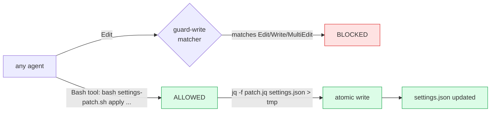

# Sprint v15-18B — Settings.json Patch Migration Tool

> Unblock v15-16 Story B (the deferred `.*` matcher narrowing that saves
> ~3 hook spawns per Read/Grep/Glob ≈ 150 spawns per codebase scan) by
> building a safe, bash-based migration tool. Bonus: future settings
> migrations get a canonical path instead of "human edits between
> sessions" or the maintainer-grant ceremony.

## Sprint metadata

- **ID**: sprint-v15-18b-settings-patch-tool
- **Points**: 3
- **Status**: SELECTED
- **Branch**: `claude/sprint-v15-18b-settings-patch-tool`
- **Driver**: v15-16 Story B deferred 2026-05-18 — needed maintainer-grant or hand-edit. v15-08..17 series retro 2026-05-20 ranked this as the biggest user-visible perf win still on the table.

## Why bash + jq sidesteps guard-write

`guard-write.sh` matches only `Edit|Write|MultiEdit` (PreToolUse). Bash invocations of `jq` aren't gated — they're shell operations, not file-editing tool calls. Backup-first + atomic rewrite ensures the safety the guard was protecting AGAINST is preserved.

## Stories

| Story | Pts | Description |
|---|---|---|
| **A — `tools/aegis-settings-patch.sh`** | 1 | Bash CLI: `list / dry-run / apply / revert`. jq-driven (atomic JSON edits). Timestamped backups to `.aegis/brain/state/settings-backups/`. Prominent "CC restart required" warning post-apply. |
| **B — First patch: narrow PostToolUse matcher** | 1 | `tools/aegis-settings-patches/narrow-posttooluse-matcher.jq` — jq filter that swaps `.*` → `Bash\|Edit\|Write\|MultiEdit\|Task`. Idempotent (no-op on second apply). Demonstrates the tool by closing v15-16 Story B for the AEGIS-Team meta itself. |
| **C — Regression tests + meta-apply** | 1 | `tests/aegis-settings-patch-test.sh` × 6 — list / dry-run / apply / revert / idempotency / semantic-preservation. Apply patch to AEGIS-Team settings.json to demonstrate end-to-end. |

## Acceptance criteria

1. `bash tools/aegis-settings-patch.sh list` shows all available patches with descriptions
2. `dry-run <patch>` shows diff without modifying file
3. `apply <patch>` writes new content + creates timestamped backup at `.aegis/brain/state/settings-backups/settings-YYYYMMDD-HHMMSS-pre-<patch>.json`
4. `revert <patch>` restores from most recent backup
5. Same patch applied twice = byte-identical result (idempotent)
6. Other settings entries untouched when patching the `.*` matcher (semantic preservation)
7. AEGIS-Team's own `.claude/settings.json` patched to narrow matcher (Story B closed for meta)
8. Suite stays GREEN (61 → 62 PASS with new test)
9. Restart-required warning prominently displayed on apply

## Out of scope

- Auto-detect CC restart status / force-restart — too invasive, user controls their session
- Patches that REMOVE hooks or restructure beyond simple field-swap — out of scope for this tool's safety model
- Generic schema validation — defer to jq's own JSON parse (atomic = safe; format-level validation is enough)
- Distributing patches as separate package — they're co-located with the tool in `tools/aegis-settings-patches/`

## Verification plan

1. `bash tests/aegis-settings-patch-test.sh` → 6/6 PASS
2. `bash tests/run-all.sh --continue` → 62/62 PASS
3. Manual: `bash tools/aegis-settings-patch.sh apply narrow-posttooluse-matcher` on AEGIS-Team meta, verify `.claude/settings.json` has new matcher
4. After next CC restart: confirm Read/Grep/Glob tool calls no longer fire token-profile + live-tail + activity-logger hooks
