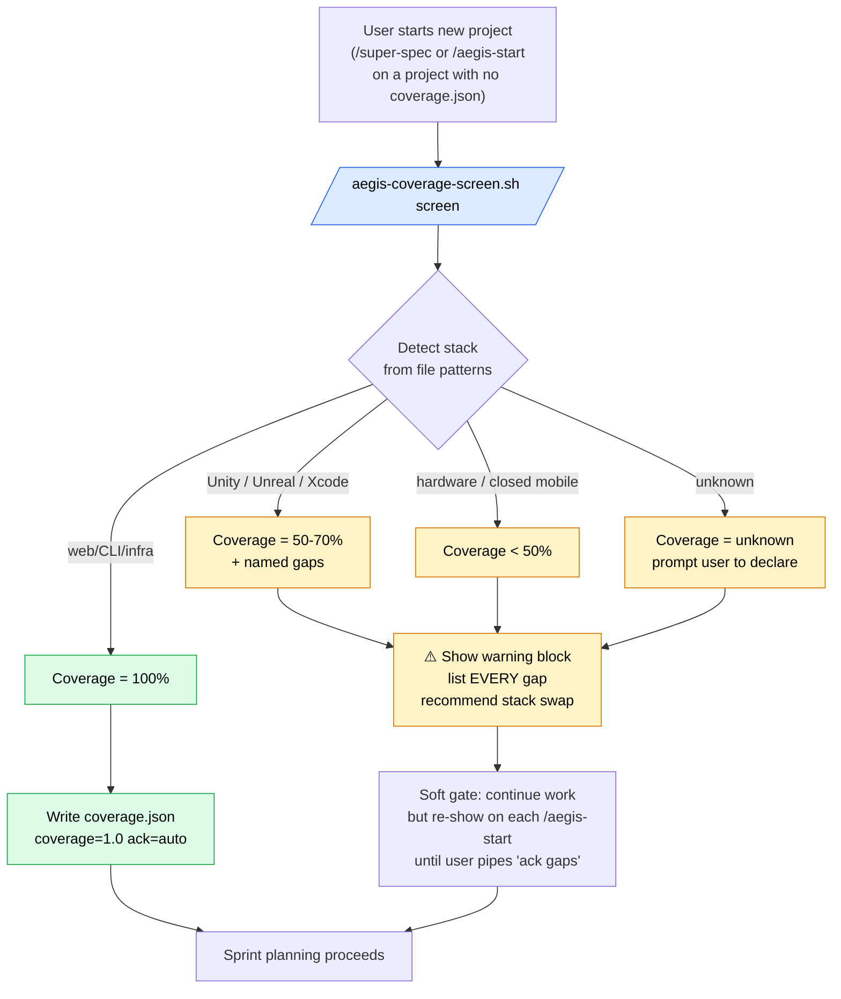

# Sprint v15-19 — AEGIS Coverage Screen (Tool-Boundary Warnings)

> Operationalize the rule the user crystallized 2026-05-21 (Contra-Thai retro):
> "AEGIS contract = 100% autonomy. Human only does (1) requirements + (2)
> credentials. AEGIS MUST warn user about ANY project where coverage < 100% —
> list every gap, not just big ones. Mandatory even at 99%."
>
> Closes the bug class where AEGIS silently takes on projects it can't drive
> end-to-end (e.g. Unity → can't press Build → 3 'successful' sprints with zero
> playable artifact).

## Sprint metadata

- **ID**: sprint-v15-19-coverage-screen
- **Points**: 4
- **Status**: SELECTED
- **Branch**: `claude/sprint-v15-19-coverage-screen`
- **Driver**: User feedback 2026-05-21 after Contra-Thai post-mortem. See [[feedback_aegis_coverage_contract]] in memory.
- **Gate style**: **soft** — show the warning prominently, never block sprint execution. Soft gate chosen by user 2026-05-21 over the "hard ack" alternative.

## The architecture (one diagram)

## Stories

| Story | Pts | Description |
|---|---|---|
| **A — `tools/aegis-coverage-screen.sh`** | 1 | CLI: `detect / screen / show / ack <project>`. Stack detector (file pattern heuristics), coverage table (per known stack), warning emitter (Thai + English), writes `.aegis/brain/state/coverage.json`. |
| **B — `skills/aegis-coverage-screen.md`** | 1 | Skill doc + integration into `/super-spec` as new Phase 0 ("Tool-Boundary Screen") between brief and Q&A. Adds 1 line to `/aegis-start` to re-show the warning if coverage<1.0 and no ack. |
| **C — `tests/aegis-coverage-screen-test.sh`** | 1 | 8 fixtures: web, unity, xcode, godot-cli, terraform, rust, empty, mixed. Idempotency check. JSON-output schema check. Soft-gate verification (process exit 0 always). |
| **D — Retroactive Contra-Thai warning** | 1 | Run the tool on `~/Documents/Contra-Thai/`, write `coverage.json` there (with `ack: 'retroactive 2026-05-21'`), produce the warning artifact as a chat block. Demonstrates "what AEGIS should have said on day 1". |

**Total**: 4pt

## Soft gate semantics

The user explicitly chose "soft" over "hard" because hard ack creates friction on every legitimate stack swap. Soft means:

1. **Warning emitted, no halt** — process exit 0, no `permissionDecision: "deny"`, no exception raised. Work continues.
2. **Persistent re-surface** — `/aegis-start` re-prints the warning IF `coverage.json` shows `coverage < 1.0 AND ack != true`. Idle re-surface prevents the user scrolling past once and forgetting.
3. **Easy ack** — user types `ack gaps` in chat (or sets `ack: true` in the JSON manually). After ack, the warning silences but the metadata persists.
4. **Sprint close DoD non-block** — Sprint close.md GAINS a "tool-boundary lag" line ("days since last user-runnable artifact"). It's reported but doesn't fail the close. Reporting alone is enough — once it's in close.md, retro will surface it.

If the soft gate proves ignored in practice (future Loki finding), upgrade to hard in v15-20+.

## Acceptance criteria

- [ ] `aegis-coverage-screen.sh detect` correctly classifies all 8 test fixtures
- [ ] Warning block renders Thai + English (per [[plain-thai-voice]] — plain Thai not dev-Thai)
- [ ] `coverage.json` schema documented + JSON-validated by tests
- [ ] `/super-spec` Phase 0 runs the screen before Phase 1 Q&A
- [ ] `/aegis-start` re-prints warning if coverage<1.0 unack'd
- [ ] Contra-Thai gets its retroactive `coverage.json` + visible warning artifact
- [ ] Soft gate: process exit 0 in all paths (verified by test T-soft-gate)
- [ ] Test suite green standalone (61+1 = 62 tests min)

## What this does NOT do (deferred)

- **Hard ack gate** (deferred to v15-20+ if soft proves ignored)
- **LLM-based stack detection** (heuristic file-pattern is enough for the common cases; LLM only as fallback for unknown)
- **Per-credential gap classification** (current "credentials = human-provided" is one-bucket; could split into "OAuth flow needs human browser" vs "raw API key" in v15-21+)
- **Migration of all 7 downstream projects' coverage.json** (will be auto-generated on next `/aegis-start` per project; no batch backfill needed)

## Closes

- Bug class: silent low-coverage projects (Contra-Thai pattern)
- Pattern from [[feedback_aegis_coverage_contract]]: enforcement via code, not memory

## Establishes pattern for future projects

Every new project spinning up under AEGIS now gets a tool-boundary screen on day 1.
"Cannot do this end-to-end" is a knowable state, not a discovery at sprint 3.
