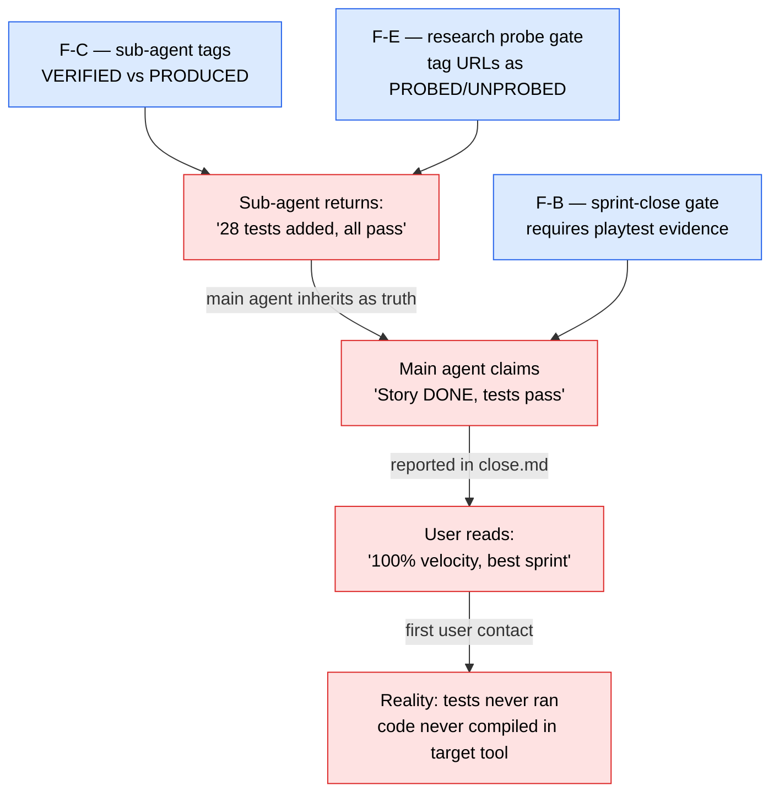

# Sprint v15-20 — Verified, Not Just Produced

> Close F-B, F-C, F-E from the Contra-Thai research report
> (`2026-05-20-research-report-llm-aegis-unity-verification-failure.md`).
> v15-19 closed F-A (project-class detection). This sprint kills the
> deeper bug class: agents claiming `done` when they mean `produced`,
> with no enforced separation between the two.
>
> Driver: 5 fabricated Kie.ai endpoint bugs + Unity "100% velocity"
> across 3 sprints with zero playable artifact. Both traced to the
> same root: sub-agent returns conflate produced and verified; main
> agent inherits paper claims as ground truth.

## Sprint metadata

- **ID**: sprint-v15-20-verified-not-produced
- **Points**: 5
- **Status**: SELECTED
- **Branch**: `claude/sprint-v15-20-verified-not-produced`
- **Gate style**: **soft** — same as v15-19. Warn, don't block. If practice shows soft is ignored (future Loki finding), upgrade to hard.

## Closes

| Finding | Source | Sprint v15-19 | Sprint v15-20 |
|---|---|---|---|
| F-A — Project-class declaration at init | Contra-Thai retro | ✓ closed | — |
| F-B — Playtest-result requirement at sprint close | Contra-Thai retro | (deferred) | ✓ Story B |
| F-C — Sub-agent return tagging (`[VERIFIED]`/`[PRODUCED]`) | Contra-Thai retro | (deferred) | ✓ Story A |
| F-D — Bidirectional asmdef cycle check | Contra-Thai retro | (skipped — Unity-specific, narrow audience; covered transitively by F-A warning + F-B playtest gate) | — |
| F-E — Research-doc URL probe gate | Contra-Thai retro | (deferred) | ✓ Story C |

## The bug class (one diagram)

## Stories

| Story | Pts | Description |
|---|---|---|
| **A — F-C: Sub-agent return tagging convention** | 2 | Persona docs (11 agents) gain a "Return Format" section requiring each non-trivial claim be tagged `[VERIFIED: <command>]` or `[PRODUCED: unverified]`. New helper `tools/aegis-return-validator.sh` scans recent sub-agent return text + reports unverified-claim ratio. Soft — no hook block; main-agent persona doc just gains the rule + the validator surfaces drift. |
| **B — F-B: Sprint-close playtest gate** | 2 | New `tools/aegis-sprint-close-gate.sh` runs at `/aegis-sprint close`. Reads `coverage.json` + per-story `_aegis-output/playtests/S<NN>-result.md`. For projects with coverage<1.0, emit warning at close if playtest files missing or `pass != true`. Soft — sprint close still proceeds; the gate fires a warning block into close.md. |
| **C — F-E: Research probe-gate** | 1 | New `tools/aegis-research-probe.sh` scans research docs for URLs/endpoint patterns and tags them `[PROBED ✓]` (HEAD/OPTIONS request returns 2xx/3xx) or `[UNPROBED]` (no live response). Skill `aegis-research-doc-format` documents the convention. Beast persona doc gains "must run probe on every URL in research output" rule. |

**Total: 5 pt** (2 + 2 + 1)

## Acceptance criteria

- [ ] All 11 personas have a "Return Format" section with VERIFIED/PRODUCED tagging rule
- [ ] `tools/aegis-return-validator.sh` correctly classifies a 3-claim fixture (1 VERIFIED, 1 PRODUCED, 1 untagged)
- [ ] `tools/aegis-sprint-close-gate.sh` emits warning when playtest files missing for GUI-runtime project; emits nothing when coverage=1.0
- [ ] `tools/aegis-research-probe.sh` tags 2/2 URLs in a fixture (1 live, 1 dead) correctly
- [ ] CLAUDE.md gains "Verified vs Produced" section
- [ ] Tests green standalone (3 new test suites, ~20 cases total)

## Soft gate philosophy

Same as v15-19: warn-only. Reasons:
1. Hard gate on sprint close = workflow friction. AEGIS users would route around with `--skip-gate`. Soft warning that prints in close.md is **harder to ignore** than a blocked command (which prompts a workaround).
2. Hard gate on sub-agent return = breaks parallel dispatch (main can't tell mid-stream what's verifiable vs not).
3. Hard gate on URL probes = breaks research dispatches when running offline / behind firewalls.

If soft gate proves ignored, upgrade in v15-21.

## What this does NOT do (deferred)

- F-D (Unity asmdef cycle check) — narrow audience; covered transitively by F-A + F-B
- Hook-level block of unverified returns (would require parsing every sub-agent return at the tool boundary; v15-21 candidate if soft proves insufficient)
- Automated playtest-result file generation (requires the user to author them; can't outsource)
