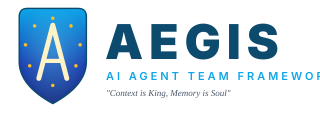

<p align="center">
  
</p>

<p align="center">
  
  
  
  
  
  
  
  
  
  
</p>

# :shield: AEGIS v15.0 — AI Agent Team Framework for Claude Code

> **"Context is King, Memory is Soul"**
>
> :dna: Nick Fury · 11 Marvel Agents · 16 canonical commands · 37 Skills · 14 Hooks · 60+ Helper Tools · NDJSON knowledge graph · Linear hub mirror · ISO 29110 · Diagram-first reflex · CC 2.1.141 native · [`PROJECT_INDEX.md`](PROJECT_INDEX.md) (auto-generated by v12-06)

---

## :sparkles: New in v12.x — Linear hub integration (May 2026)

**Linear is now AEGIS's stakeholder display layer** — a lightweight one-way mirror of `kanban.md`. Kanban stays the source of truth (offline, git-tracked, ISO 29110); Linear becomes the visual board for anyone outside the terminal. Three PRs shipped: [#154](https://github.com/phariyawitjiap-aeternix/AEGIS-Team/pull/154) (feature), [#155](https://github.com/phariyawitjiap-aeternix/AEGIS-Team/pull/155) (parser + marker hardening), [#156](https://github.com/phariyawitjiap-aeternix/AEGIS-Team/pull/156) (session brain artifacts).

**What you get:**
- 1 git repo → 1 Linear project (auto-created on first `/aegis-sprint plan`)
- 1 sprint → 1 Project Milestone (NOT a Linear Cycle — milestones are project-scoped, no cross-project leak)
- 1 kanban story → 1 Linear Issue with rich description: **Sprint Goal** + **Task** (multi-line from kanban continuation) + **Metadata table** (Story ID / Sprint / Owner / Subtype / Points / PR)
- Auto-labels: `aegis` + `subtype:{build|design|test|docs|devops|orchestrate|ui|content|review|research|data|refactor|scout}` derived from agent role
- **Content-hash idempotency** (SHA1 over canonical source fields → marker `<!-- aegis-sync:SPRINT_ID/STORY_ID v=hash -->`) — re-syncs are no-ops, Linear's markdown normalization is tolerated
- **3-tier parser** covers all historical kanban formats: bullet-list (v9..v12), table-kanban (sprint-1..3), `## Stories` / `## Tasks` in plan.md (v13+)
- **Hook auto-fire** on `Edit|Write` of `.aegis/brain/sprints/sprint-*/kanban.md` — Linear stays in sync within seconds of every kanban write

**Architecture:**
```
[ kanban.md (markdown) ] ── one-way ──▶ [ Linear Project + Milestones + Issues ]
  source of truth                          stakeholder display layer
  git-tracked, offline                     visual, shareable, no lock-in
```

**Bootstrap a new repo in one command:**
```bash
cd ~/Documents/my-new-project
bash tools/aegis-linear-bootstrap.sh    # auto-discovers workspace/team/state-map
# next /aegis-sprint plan auto-creates the Linear project
```

**Skill / command:** [`/aegis-linear`](.claude/commands/aegis-linear.md) — subcommands: `health · setup · sync · open · close · drift`
**Tools:** [`tools/aegis-linear-{bootstrap,setup,sync}.sh`](tools/) — 1,200+ lines, 0 secrets in git, keychain-backed auth, fail-graceful when Linear is offline or quota-capped
**Throwaway / shared modes:** set `.aegis/config/linear.json` → `project.throwaway = true` (PoC repos skip sync) or `project.shared_with = "AEGIS Experiments"` (umbrella for small projects)

---

## :sparkles: What's new in v12 — Knowledge Layer

**v12 = AEGIS knows itself.** Before v12, the framework had 30+ skills, 13 hooks, 60+ tools — and no machine-readable map of how they fit. After v12, every skill has a typed frontmatter schema, every governance doc carries a versioned changelog, every recurring failure mode is captured as a Sign, and a 234-node NDJSON knowledge graph answers "what wires this, what tests it, what brain paths it touches" in 50ms.

**Phase A — Doc canon (18pt):**
- [`DoD.md`](DoD.md) — repo-wide stable completion bar (9 sub-bars)
- [`ARCHITECTURE.md`](ARCHITECTURE.md) — concern→file map, hook DAG, brain ingestion DAG
- [`GUARDRAILS.md`](GUARDRAILS.md) — 12 Signs (Trigger/Do/Why) covering recurring v11 fix-classes
- Versioned `<!-- version: -->` + Changelog tables on every governance doc, lint-enforced
- Skill frontmatter schema (5 graph keys: reads/writes/wires/tests/supersedes), backfilled across 39 skills

**Phase B — Knowledge graph (21pt):**
- `tools/aegis-brain-graph/build.mjs` → `.aegis/brain/graph/{nodes,edges}.ndjson` + `meta.json` (234 nodes, 257 edges, 360ms cold build, byte-deterministic)
- 5 query subcommands: `impact / context / detect-changes / mentions / wiring`
- Auto-wiki: `PROJECT_INDEX.md` + `_aegis-output/wiki/skill-<name>.md` + `sprint-<id>.md` regenerated from graph (byte-equal-skip on unchanged content)
- SessionStart staleness banner when graph predates HEAD

Full v12 plan: `~/Documents/AEGIS-KNOWLEDGE-MEGA-PLAN.md`

## :sparkles: What's new in v11 — Operational Layer (AEGIS-Plus)

**v11 = governance primitives ported from Paperclip into terminal-only AEGIS.** 10 sprints, 63pt, 100% shipped. Each is now a top-level skill:
- [`aegis-live-tail`](skills/aegis-live-tail.md) — always-on terminal conversation stream
- [`aegis-activity-logger`](skills/aegis-activity-logger.md) — JSONL audit log per UTC day
- [`aegis-issue-thread`](skills/aegis-issue-thread.md) — YAML ticket layer
- [`aegis-parallel-dispatch`](skills/aegis-parallel-dispatch.md) — Agent fan-out skill
- [`aegis-approval-gate`](skills/aegis-approval-gate.md) — PreToolUse destructive-op blocker
- [`aegis-router`](skills/aegis-router.md) — model-tier picker (quality fit)
- [`aegis-run-logger`](skills/aegis-run-logger.md) — Stop hook session archiver
- [`aegis-trace-export`](skills/aegis-trace-export.md) — PII-redacted activity export
- [`aegis-multi-tenant`](skills/aegis-multi-tenant.md) — cross-project registry + aggregator
- [`aegis-resume`](skills/aegis-resume.md) — checkpoint + SessionStart resume

Full v11 plan: `~/Documents/AEGIS-PLUS-MEGA-PLAN.md` v1.1

## :sparkles: What was new in v9.0 + v10

**Framework hardening + brain layer + ecosystem + traceability wiki.** v9 in-repo **100% shipped** (73/69pt across 6 sprints); v10 framework-application phase complete (39/39pt). Full audit in [.claude/references/v9-follow-ups.md](.claude/references/v9-follow-ups.md). Cross-reference every doc, requirement, module, function and task in [`PROJECT_INDEX.md`](PROJECT_INDEX.md).

### Agent consolidation (13 → 10)
- **War Machine absorbed Vision** (QA Lead + Executor combined)
- **Coulson absorbed Songbird** (docs + content merged)
- **Wasp retired** (UX → Spider-Man + style guide)
- Archived prompts preserved in `.claude/agents/_archived/` for reference

### Brain layer (Sprint v9-03 / v9-04)
- `.aegis/brain/` single-folder home (was `_aegis-brain/`)
- `tools/aegis-brain-sync.sh` regenerates `MEMORY.md` index atomically
- `tools/aegis-brain-write.sh` library/CLI for atomic brain writes + S4-02 proxy directive for `memory_20250818`
- Session-start hook combines version check + brain sync
- Adversarial test suite (`aegis-brain-adversarial-test.sh`, 9/9 green)

### Worktree isolation (Sprint v9-05)
- `tools/aegis-merge-worktree.sh` — rebase-onto-HEAD + `-f -f` cleanup escalation
- Spider-Man default: `isolation: worktree` for code edits
- Real blast-radius via git boundaries, not just markdown rules

### ADR-004: `AEGIS_MAINTAINER_MODE` (Sprint v9-02)
Principled override channel so the framework can evolve in-session when the human explicitly authorizes:
- `tools/aegis-maintainer-grant.sh` — human-run token generator
- Token format: `<path>|<nonce>|<expiry-epoch>`, one-shot, 60s TTL
- `guard-write.sh` honors valid grants; `guard-bash.sh` blocks agent self-grants
- 23/23 test assertions across scope escape, one-shot consume, expiry, concurrent grants

### BLOCK 0 lite mode (Sprint v9-02)
- `tools/aegis-block0-mode.sh` — lite/standard/full mode per task
- 1pt chores skip SI.01/SI.02; security/breaking tags force full gate
- Nick Fury + Coulson agent prompts wired; 31/31 test assertions

### S6-01 distill reminder (Sprint v9-06)
- Session-start counter + auto-reminder at threshold
- `/aegis-distill` resets via `tools/aegis-distill-reset.sh`
- 13/13 test assertions; no external scheduler needed

### Hardened permissions (Sprint v9-01)
- `defaultMode: acceptEdits` (was `bypassPermissions` — security-sensitive change)
- 26 deny patterns (was 8), 20 scoped allow (was 60+ wildcards)
- `guard-bash.sh` blocks Golden Rule violations + dangerous ops

### New ops tools
- `/aegis-status` — multi-mode status dashboard (skill, supersedes the v9 `aegis-status-brief.sh` shell tool which was archived in sprint-v13-01 Phase A)
- `aegis-test-all.sh` — unified runner across 4 test suites (76/76 green)
- `aegis-agent-tools-matrix.sh` — subagent tool availability pre-flight
- `aegis-pending-items.sh` — spec-freshness audit primitive

### Ecosystem handoff docs
- [AEGIS_v9_ECOSYSTEM_GUIDE.md](AEGIS_v9_ECOSYSTEM_GUIDE.md) — bootstrap for v9-07 through v9-15 (brain-tier, MCP, plugin, migration+GA) as separate engineering streams
- [AEGIS_EXTERNAL_ADOPTION.md](AEGIS_EXTERNAL_ADOPTION.md) — apply AEGIS to a non-meta target project

---

## What is AEGIS?

AEGIS (**A**utonomous **E**nhanced **G**roup **I**ntelligence **S**ystem) — production-grade AI agent team framework for Claude Code. 11 Marvel-character agents, 16 canonical commands, 37 skills, 14 hooks, 60+ helper tools, ISO 29110 compliance, JIRA-like PM, self-enforcing instinct system, principled maintainer-override channel, real worktree isolation, CC 2.1.141 native (modern permission-decision schema, terminalSequence notifications, `claude --cwd` multi-tenant, diagram-first reflex). :dna: ยิ่งใช้ยิ่งเก่ง.

---

## :rocket: New Install (one command)

**Step 1 — Install prerequisites (skip if already done):**

```bash
brew install node && npm install -g @anthropic-ai/claude-code
```

**Step 2 — Initialize your project:**

```bash
cd ~/Documents/my-project && git init && git commit --allow-empty -m "init"
```

**Step 3 — Install AEGIS:**

```bash
bash <(curl -sL https://raw.githubusercontent.com/phariyawitjiap-aeternix/AEGIS-Team/main/install-remote.sh) --profile full --project-name "My Project"
```

> :bulb: Profile options: `minimal` (7 skills) · `standard` (15 skills) · `full` (30 skills)

**Step 4 — Set permissions (one-time):**

```bash
cat > ~/.claude/settings.json << 'EOF'
{"permissions":{"defaultMode":"bypassPermissions","allow":["Bash","Edit","Write","Read","Glob","Grep","Agent","TeamCreate","TeamDelete","SendMessage"]},"env":{"CLAUDE_CODE_EXPERIMENTAL_AGENT_TEAMS":"1"}}
EOF
```

**Step 5 — Start:**

```bash
claude --dangerously-skip-permissions
```

Then type `/aegis-start`. Nick Fury will scan your project, check **BLOCK 0** (required ISO docs + kanban), and begin autonomously.

**What you get with a fresh install:**

| | |
|--|--|
| :dna: **13 Marvel agents** | Nick Fury, Iron Man, Spider-Man, Black Panther, Loki, Coulson, Thor + 6 more |
| :lock: **BLOCK 0 gate** | Coulson creates PM.01 + SI.01 + SI.02 + kanban before any code is written |
| :brain: **Claude 4.x models** | Opus 4.6 (1M ctx) for thinkers · Sonnet 4.6 (1M ctx) for builders · Haiku 4.5 for scanners |
| :chart_with_upwards_trend: **Adaptive thinking** | Each agent uses the right reasoning depth (`max` → `low`) |
| :scroll: **ISO 29110** | 14 work products, activity-time generation, traceability matrix |

---

## :arrows_counterclockwise: Upgrade Existing Install

> :warning: **Exit Claude Code before upgrading** — Claude caches files at session start

**Step 1 — Run the upgrade:**

```bash
cd ~/Documents/my-project
bash <(curl -sL https://raw.githubusercontent.com/phariyawitjiap-aeternix/AEGIS-Team/main/install-remote.sh) --upgrade
```

**Step 2 — Restart:**

```bash
claude --dangerously-skip-permissions
```

**What `--upgrade` does:**

| Step | Action |
|:----:|--------|
| 1 | :lock: **Backup** `.aegis/brain/` (plus `_aegis-brain/` for v8 users), `iso-docs/`, `CLAUDE_lessons.md`, and `.claude/settings.json` → `_aegis-backup-<timestamp>/` |
| 2 | :arrows_counterclockwise: **Migrate** (v8→v9 only) `_aegis-brain/` → `.aegis/brain/` if the new path doesn't exist yet |
| 3 | :wastebasket: **Remove** old agents, commands, references, teams, skills |
| 4 | :arrow_down: **Download** latest AEGIS from GitHub (to `/tmp/`, auto-cleaned) |
| 5 | :package: **Install** 11 Marvel agents, 16 canonical commands, references + teams, 37 skills, 14 hooks, 60+ helper tools |
| 6 | :mag: **Verify** all files present + auto-detect profile from project-identity.md |

**What's new in v9.0 (vs v8.4):**

| Change | Details |
|--------|---------|
| :busts_in_silhouette: Agent consolidation | 13 → 10 agents. War Machine absorbed Vision, Coulson absorbed Songbird, Wasp retired. Archived in `.claude/agents/_archived/` |
| :brain: Brain folder move | `_aegis-brain/` → `.aegis/brain/`. Single-folder home; installer auto-migrates on upgrade |
| :floppy_disk: Brain sync/write | `tools/aegis-brain-sync.sh` (atomic MEMORY.md regen) + `tools/aegis-brain-write.sh` (atomic write + S4-02 `memory_20250818` proxy directive) |
| :twisted_rightwards_arrows: Worktree isolation | `tools/aegis-merge-worktree.sh` with stale-ancestor rebase + process-lock escalation. Spider-Man default: `isolation: worktree` |
| :key: ADR-004 override | `AEGIS_MAINTAINER_MODE` scoped, time-bounded, one-shot grant for principled framework evolution. `tools/aegis-maintainer-grant.sh` |
| :white_check_mark: BLOCK 0 lite mode | Per-task mode (lite/standard/full). 1pt chores skip SI.01/SI.02; security forces full. `tools/aegis-block0-mode.sh` |
| :lock: Hardened permissions | `defaultMode: acceptEdits` (was bypassPermissions); 26 deny patterns, 20 scoped allow |
| :chart_with_upwards_trend: 76/76 test suite | `tools/aegis-test-all.sh` runs 4 suites: brain-adversarial, maintainer-mode, distill-counter, block0-mode |
| :scroll: Ecosystem docs | [AEGIS_v9_ECOSYSTEM_GUIDE.md](AEGIS_v9_ECOSYSTEM_GUIDE.md) + [AEGIS_EXTERNAL_ADOPTION.md](AEGIS_EXTERNAL_ADOPTION.md) |

**:lock: NEVER touched by upgrade:** `.aegis/brain/` (tasks, sprints, patterns, learnings), `iso-docs/`, `CLAUDE_lessons.md`, project source code. The old `_aegis-brain/` is preserved in the backup dir.

---

## :movie_camera: See It In Action

### `/aegis-start` — Mother Brain activates with heartbeat

```
🛡️ ═══════════════════════════════════════════════════
🛡️  AEGIS v11.0 — Session Started
🛡️  "Context is King, Memory is Soul"
🛡️ ═══════════════════════════════════════════════════

📋 Project:    My SaaS App
📅 Date:       2026-03-30
🎚️  Profile:    full (25 skills)
🔐 Autonomy:   L3 — Autonomous (Mother Brain active)
📊 Context:    8% used

🧬 Mother Brain: ONLINE — persistent heartbeat active

💓 Heartbeat: Scanning project state...
   Mother Brain will continuously monitor and dispatch agents.
   She never sleeps until the session ends.

👀 Watch: Shift+Down to view agent detail | Shift+Up to return
🛑 Stop: Ctrl+C to interrupt | /aegis-mode --autonomy L1 for manual
```

```
🧬 Mother Brain: Scan complete.

📊 Scan Results:
  ├── Git: clean (main, 12 commits)
  ├── Tests: PASS (28/28)
  ├── Sprint: sprint-2 active (day 3/5)
  ├── Kanban: 3 TODO, 1 IN_PROGRESS, 2 DONE
  ├── QA: pending for PROJ-T-007
  ├── Compliance: 8/11 ISO docs current
  └── Tech Debt: 5 TODOs, 2 FIXMEs

🎯 Decision: P2.5 — Active sprint, pick next TODO from kanban
   Task: PROJ-T-008 "Add payment webhook handler" [5pts]
   Rationale: Highest priority TODO in sprint-2, spec exists.

⚡ Action: Spawning build team...
   → 📐 Sage: Validate spec for PROJ-T-008
   → ⚡ Bolt: Implement webhook handler
   → 🛡️ Vigil: Code review (Gate 1)

💓 Heartbeat: 3 agents alive | context 15% | next pulse in 30s
```

### `/aegis-status` — Live dashboard with heartbeat

```
╔══════════════════════════════════════════════════════════════════╗
║  AEGIS Team Status                              v9.0            ║
╠══════════════════════════════════════════════════════════════════╣
║                                                                 ║
║  💓 Mother Brain: ALIVE (last pulse: 8s ago)                    ║
║     Cycle: #4 | Agents spawned: 3 | Tasks done: 2              ║
║                                                                 ║
║  Agent          Task                    Status      Progress    ║
║  ─────────────  ──────────────────────  ──────────  ────────    ║
║  📐 Sage        Validating spec         ✅ Done     100%        ║
║  ⚡ Bolt        Implementing webhook    🔄 Working  60%         ║
║  🛡️ Vigil       Waiting for Bolt        ⏳ Waiting  —           ║
║                                                                 ║
║  Pipeline: Build Team [████████████░░░░░░░░] Step 2/3           ║
║  Context: 22% used 🟢 | ~78% remaining                         ║
║                                                                 ║
╚══════════════════════════════════════════════════════════════════╝
```

### `/super-spec` — Human Q&A then full autonomy

```
📐 Sage: I've analyzed your brief and researched similar systems.
Before I write the spec, I need your input:

📌 BUSINESS CONTEXT
1. Who are the primary users?
2. What specific problem does this solve?
3. How do they solve this today?

📌 SCOPE & PRIORITIES
4. What are the MUST-HAVE features for v1? (top 3-5)
5. What is explicitly OUT of scope?

📌 CONSTRAINTS
7. Tech stack preference?
8. Timeline pressure?

📌 SUCCESS
10. How will you measure success?
```

> :bulb: After you answer and approve the spec, Mother Brain enters **Spec Proxy mode** — she answers all team questions using your approved spec. No more interruptions.

```
🧬 Mother Brain: Spec approved. Entering Spec Proxy mode.
   I now have full context from BRD + SRS + UX Blueprint.
   I will answer team questions on your behalf.
   I'll only ask you for business decisions outside the spec.

💓 Resuming full autonomy (L3)...
   → Running /aegis-breakdown from spec...
   → Running /aegis-sprint plan...
   → Spawning build team for first task...
```

---

## :busts_in_silhouette: The 10 Agents (v9 consolidated)

| # | Agent | Model | Role |
|:-:|:------|:-----:|:-----|
| :dna: | **Nick Fury** | `opus 4.6` | Autonomous Controller — scans, decides, spawns teams, enforces BLOCK 0 |
| :compass: | **Captain America** | `opus 4.6` | Navigator/Lead — orchestrates, synthesizes, retros |
| :triangular_ruler: | **Iron Man** | `opus 4.6` | Architect — specs, system design, ADRs |
| :zap: | **Spider-Man** | `sonnet 4.6` | Implementer — writes code, builds features |
| :shield: | **Black Panther** | `sonnet 4.6` | Reviewer — 5-pass code review, quality gates |
| :red_circle: | **Loki** | `opus 4.6` | Devil's Advocate — challenges assumptions, finds flaws |
| :wrench: | **Beast** | `haiku 4.5` | Scanner/Research — programmatic codebase analysis |
| :art: | **Wasp** | `sonnet 4.6` | UX Designer — UI/UX, accessibility |
| :paintbrush: | **Songbird** | `haiku 4.5` | Content Creator — docs, changelogs |
| :dart: | **War Machine** | `sonnet 4.6` | QA Lead — test strategy, release gate |
| :microscope: | **Vision** | `haiku 4.5` | QA Executor — runs tests, reports raw results |
| :scroll: | **Coulson** | `haiku 4.5` | Compliance — ISO 29110, BLOCK 0 gate owner |
| :rocket: | **Thor** | `sonnet 4.6` | DevOps — deploy, health check, rollback |

> **Routing:** Opus (1M ctx, max thinking) → Sonnet (1M ctx, medium thinking) → Haiku (200k ctx, low thinking)

---

## :factory: SDLC Pipeline

```
BLOCK 0 (Coulson) → BREAKDOWN → SPRINT PLAN
     ↓
[ SPEC → BUILD → REVIEW(G1) → QA(G2) → COMPLY(G3) ] → CLOSE → DEPLOY(G4) → MONITOR(G5) → FEEDBACK
  └──────────────── per-task loop ─────────────────┘
```

> BLOCK 0 is a hard gate. No task enters the per-task loop until PM.01 + SI.01 + SI.02 + kanban exist.

---

## :vertical_traffic_light: 6-Gate Quality System

| Gate | Name | Owner | Blocks |
|:----:|:-----|:------|:-------|
| **G0** | **Pre-Work Docs** | **Coulson** | **PM.01 + SI.01 + SI.02 + Epic/Task/Sub-task + Kanban must exist** |
| G1 | Code Review | Black Panther | 5-pass: correctness, security, performance, maintainability, compliance |
| G2 | Product QA | War Machine | Test plan, execution, coverage, verdict |
| G3 | Compliance | Coulson | ISO 29110 work products, traceability matrix |
| G4 | Deploy | Thor | Build, deploy, health check, smoke test |
| G5 | Monitor | Thor | Post-deploy health, metrics, rollback readiness |

> Gate 0 is enforced by Nick Fury at session start and before every IN_PROGRESS transition.

---

## :keyboard: Commands (29)

| Command | Purpose |
|:--------|:--------|
| `/aegis-start` | Begin session — Nick Fury activates + checks BLOCK 0 |
| `/aegis-retro` | End session — retrospective + lessons |
| `/aegis-handoff` | Handoff document for next session |
| `/aegis-pipeline` | Full analysis pipeline (all agents) |
| `/aegis-status` | Check all agent progress |
| `/aegis-mode` | Switch profile: `minimal` / `standard` / `full` |
| `/aegis-context` | Context budget usage + token breakdown |
| `/aegis-distill` | Compress conversation context |
| `/aegis-memory` | Read/write persistent brain |
| `/aegis-verify` | Verify outputs meet acceptance criteria |
| `/aegis-launch` | Launch specific agent with task |
| `/aegis-flow` | Visualize pipeline flow + dependencies |
| `/aegis-team-build` | Spawn build team (Iron Man + Spider-Man + Black Panther) |
| `/aegis-team-review` | Spawn review team (Black Panther + Loki + Beast) |
| `/aegis-team-debate` | Spawn debate team (Iron Man + Loki + Captain America) |
| `/aegis-kanban` | Task board with WIP limits |
| `/aegis-breakdown` | Decompose stories → epics → tasks |
| `/aegis-sprint` | Sprint ceremonies — plan, standup, review, close |
| `/aegis-qa` | QA pipeline — plan, run, report, gate |
| `/aegis-compliance` | ISO 29110 document management + audit |
| `/aegis-deploy` | Deploy pipeline — build, deploy, health, monitor |
| `/aegis-dashboard` | Project dashboard — burndown, metrics, workload |

---

## :jigsaw: Skill Profiles

| Profile | Skills | Use Case |
|:--------|:------:|:---------|
| `minimal` | 7 | Quick tasks, small projects |
| `standard` | 15 | Normal development (default) |
| `full` | 29 | Enterprise, full SDLC |

Switch: `/aegis-mode minimal` · `/aegis-mode standard` · `/aegis-mode full`

---

## :star2: Key Features

- **BLOCK 0 Pre-Work Gate** — Coulson generates PM.01 + SI.01 + SI.02 + kanban before any code is written. Nick Fury hard-blocks the team until complete.
- **Claude 4.x 1M Context** — Opus 4.6 and Sonnet 4.6 agents operate with 1M token context windows. No more session fragmentation on large codebases.
- **Adaptive Thinking** — Each agent uses the right reasoning depth: `max` for architecture, `high` for review, `medium` for implementation, `low` for scanning.
- **Programmatic Scanning (Beast)** — `code_execution_20260120` lets Beast scan 100s of files in a single round-trip, not N sequential reads.
- **Self-Evolving Intelligence** — auto-learn from tasks, shared cache across agents, skill evolution
- **ISO 29110 Compliance** — 14 work products, activity-time generation, audit trail
- **Sprint/Scrum/Kanban** — ceremonies, velocity tracking, WIP limits, burndown
- **Architecture Decision Records (ADRs)** — structured decisions with status tracking
- **Tech Debt Tracking** — continuous scanning, sprint-integrated, priority scoring
- **Persistent Brain** — resonance, learnings, retrospectives survive across sessions

---

## :thailand: Thai Triggers (ภาษาไทย)

| พิมพ์ | Triggers |
|:------|:---------|
| "เริ่ม session" | `/aegis-start` |
| "รีวิวโค้ดให้" | code-review + Black Panther |
| "ทีมสร้าง" | `/aegis-team-build` |
| "ทีมรีวิว" | `/aegis-team-review` |
| "ถกเถียง" | `/aegis-team-debate` |
| "เช็ค context" | `/aegis-context` |
| "สถานะ" | `/aegis-status` |
| "จบ session" | `/aegis-retro` |
| "ส่งต่อ" | `/aegis-handoff` |
| "วางแผน" | orchestrator + Captain America |
| "เขียน spec" | super-spec + Iron Man |
| "ตรวจความปลอดภัย" | security-audit |
| "หนี้เทคนิค" | tech-debt-tracker |
| "ท้าทายการตัดสินใจ" | adversarial-review + Loki |

---

## :file_folder: Directory Structure

```
your-project/
├── CLAUDE.md                    # Hub file (loaded every session)
├── CLAUDE_agents.md             # Agent quick reference (10 agents)
├── CLAUDE_skills.md             # Skill catalog (39 skills, 3 profiles)
├── CLAUDE_safety.md             # Safety rules
├── CLAUDE_lessons.md            # Accumulated learnings (long-form)
├── DoD.md                       # 🆕 v12-01 — repo-wide completion bar (9 sub-bars)
├── ARCHITECTURE.md              # 🆕 v12-01 — concern→file map + hook DAG
├── GUARDRAILS.md                # 🆕 v12-02 — 12 Signs (Trigger/Do/Why)
├── PROJECT_INDEX.md             # 🆕 v12-06 — auto-generated wiki index
├── .claude/
│   ├── commands/                # 12 canonical slash commands
│   ├── agents/                  # 10 Marvel agent personas (+ _archived/)
│   ├── references/              # Protocol files
│   ├── hooks/                   # 13 hook scripts
│   └── settings.json            # Permissions + hook wiring
├── skills/                      # 39 skill definitions
├── tools/                       # 60+ helper scripts + 13 tool packages
│   ├── aegis-brain-graph/       # 🆕 v12-04..06 — NDJSON knowledge graph
│   ├── aegis-doc-canon/         # 🆕 v12-01..03 — governance lints + manifest
│   ├── aegis-{live-tail,activity-logger,issue-thread,parallel-dispatch}/  # v11 P1
│   ├── aegis-{approval-gate,router,run-logger,trace-export}/              # v11 P2
│   ├── aegis-{multi-tenant,resume}/                                       # v11 P3
│   └── aegis-plus-pilot/        # bootstrap/daily-eod/gate-check/remediate
├── _aegis-output/wiki/          # 🆕 v12-06 — auto-generated per-skill / per-sprint pages
└── .aegis/brain/                # Persistent memory (never overwritten by upgrade)
    ├── resonance/               # Project identity + conventions + ADRs
    ├── learnings/               # Accumulated lessons
    ├── retrospectives/          # Per-session retros
    ├── handoffs/                # Cross-session continuity briefs
    ├── sprints/                 # Sprint plans + close.md per sprint + roadmap.md
    ├── instincts/               # Confidence-scored patterns
    ├── issues/                  # 🆕 v11-03 — YAML ticket layer
    ├── approvals/               # 🆕 v11-05 — destructive-op approval markers
    ├── activity/                # 🆕 v11-02 — JSONL audit log per UTC day (gitignored)
    ├── runs/                    # 🆕 v11-07 — Stop hook session archives (gitignored)
    ├── exports/                 # 🆕 v11-08 — PII-redacted activity exports (gitignored)
    ├── state/                   # 🆕 v11-10 — resumable session state (gitignored)
    ├── graph/                   # 🆕 v12-04 — NDJSON knowledge graph (gitignored)
    ├── index.db                 # FTS5 search index (v10-06; gitignored)
    ├── human-queue.md           # MBP escalation queue (Identity / Irreversible / External / Approval)
    └── logs/                    # Activity + decision-audit logs (gitignored)
```

---

## :sparkles: Version History

### v15.0 (current) — CC 2.1.139 + 2.1.141 adoption + transparent skill model + chain integrity (30pt across 10 sprints)

| Sprint | Pt | Headline |
|---|---:|---|
| v15-01 | 2 | `/goal` capability matrix + HYBRID decision (loop substrate = `/goal`, policy brain = Nick Fury) |
| v15-02 | 3 | Wire `/goal` into `/aegis-start` Step 4 with legacy subagent fallback for older CC |
| v15-03 | 5 | `continueOnBlock` investigation — NON-APPLICABLE (PostToolUse-only; approval-gate is PreToolUse) |
| v15-04 | 2 | `Skill(aegis-*)` wildcard cleanup — NO-OP (settings.json already wildcard-clean) |
| v15-05 | 3 | Hooks no-terminal compat audit — VERIFIED CLEAN (no tty grabs anywhere) |
| v15-06 | 2 | Transparent skill model: user surface (5) vs team surface (11) split per `.claude/references/command-audience.md` |
| v15-07 | 3 | Tighten `/aegis-start` → `/aegis-sprint plan` chain — anti-pattern banned, session-start banner when no sprint dir |
| v15-08 | 3 | CC 2.1.141 `terminalSequence` adoption — `tools/aegis-notify.sh` (OSC-9 + BEL, opt-in `AEGIS_HOOK_NOTIFY=1`) wired into 3 hooks |
| v15-09 | 5 | CC 2.1.141 approval-gate JSON schema — attributed permission dialog via `hookSpecificOutput.{hookEventName,permissionDecision,permissionDecisionReason}` |
| v15-10 | 2 | CC 2.1.141 `claude --cwd` integration — `mt cwd <name>` + `mt run <name> [-- args]` launcher in multi-tenant |
| **Total** | **30** | **AEGIS adopts CC 2.1.139 + 2.1.141; codifies "human is principal, team is operator"; sprint-plan chain hardened** |

**New doc (in PR):** [docs/AEGIS_SKILL_HIERARCHY.md](docs/AEGIS_SKILL_HIERARCHY.md) — 6 mermaid diagrams covering top-level surface, command delegation graph, persona dispatch, skills inventory, AEGIS↔external boundary (selective integration model), and sprint lifecycle. Includes v15-11 series plan (18pt) for operationalizing curated external-skill allowlist.

### v14.0 — Hermes Parity Series (47pt across 4 sprints)

| Sprint | Pt | Headline |
|---|---:|---|
| v14-01 | 13 | CommandDef registry (14 commands), brain threat scanner (12 patterns + 10 invisible chars), supply-chain-audit CI workflow |
| v14-02 | 13 | Shadow-git brain checkpoints, `/aegis-rollback` semantics, decision FTS search |
| v14-03 | 11 | `aegis-dump` (134ms), pattern-miner defer retrofit, `aegis-pin` (2-axis pin) |
| v14-04 | 10 | Persistent-goals POC (`aegis-goal/{judge,state}.sh`), measurement methodology |
| **Total** | **47** | **AEGIS reaches Hermes-parity** — 132/132 tests GREEN |

### v13.0 — Refactor + Cleanup (30pt across 2 sprints)

| Sprint | Pt | Headline |
|---|---:|---|
| v13-01-refactor | 24 | Codebase re-organize + re-factor across 5 phases; suite 44/44 GREEN on macOS + Ubuntu CI; knowledge graph 310 nodes / 446 edges |
| v13-02-cleanup | 6  | v13-01 retro action items: Rule 6 "graduate-by-running", shell-footgun scanner (caught a real brain-benchmark bug), branch-protection audit, CI-graceful pattern, DoD §5.1+5.2, empty-cache CI checklist; suite 45/45 GREEN |

### v12.x — Linear hub integration (May 2026, post-v12 patch series)

Shipped as feature PRs outside numbered sprints:

- [#154](https://github.com/phariyawitjiap-aeternix/AEGIS-Team/pull/154) — kanban → Linear sync + auto-fire hook
- [#155](https://github.com/phariyawitjiap-aeternix/AEGIS-Team/pull/155) — v3 marker (sprint-scoped) + 3-tier parser + UPDATE-path milestone repair
- [#156](https://github.com/phariyawitjiap-aeternix/AEGIS-Team/pull/156) — session brain artifacts (5 lessons captured)

### v12.0 — Knowledge Layer (39pt across 6 sprints)

| Sprint | Pt | Headline |
|---|---:|---|
| v12-01 | 8 | DoD.md + ARCHITECTURE.md + version-header lint (`tools/aegis-doc-canon/lint.mjs`) |
| v12-02 | 5 | GUARDRAILS.md (12 Signs) + `add-sign.mjs` interactive helper |
| v12-03 | 5 | Skill frontmatter schema (5 graph keys) + backfill across 39 skills |
| v12-04 | 8 | `aegis-brain-graph build` → NDJSON (234 nodes / 257 edges, 360ms cold) |
| v12-05 | 8 | 5 query subcommands: `impact / context / detect-changes / mentions / wiring` |
| v12-06 | 5 | Auto-wiki (PROJECT_INDEX + per-skill pages) + SessionStart staleness banner |
| **Total** | **39** | **AEGIS knows itself** — 149+ test assertions, 8 governance docs lint clean |

Plan: `~/Documents/AEGIS-KNOWLEDGE-MEGA-PLAN.md` v1.1

### v11.0 — AEGIS-Plus Operational Layer (63pt across 10 sprints)

Phase-1 (4 skills, 18pt): live-tail · activity-logger · issue-thread · parallel-dispatch
Phase-2 (4 skills, 32pt): approval-gate · router · run-logger · trace-export — pilot gate `OPEN` 2/3 signals
Phase-3 (2 skills, 13pt): multi-tenant · resume — shipped early on user override

Plan: `~/Documents/AEGIS-PLUS-MEGA-PLAN.md` v1.1
Pilot: `~/Documents/kam-tong-ham/` bootstrapped 2026-05-06; D-087 audit-logged

### v10.0 — Framework Application (39pt across 7 sprints)

| Sprint | Pt | Headline |
|---|---:|---|
| v10-01 | 13 | Project-wide traceability wiki + ISO 29110 docs |
| v10-02..05 | 19 | RTK readiness, MBP soft-ask detection, honest cleanup |
| v10-06 | 5 | Searchable brain (Hermes L1 — FTS5 over `.aegis/brain/`) |
| v10-09 | 3 | Per-agent allow lists |

Hermes L2 (v10-07) and L3 (v10-08) DEFERRED — pattern miner needs decision-log data; refinement loop blocked on L2.

### v9.0 — Framework Hardening + Brain Layer + Ecosystem Prep

| Feature | Before (v8.4) | After (v9.0) |
|---------|---------------|--------------|
| Agent roster | 13 Marvel characters | 10 (Vision→War Machine, Songbird→Coulson, Wasp retired) |
| Brain home | `_aegis-brain/` | `.aegis/brain/` (single-folder, easy uninstall) |
| Brain tooling | manual file ops | `aegis-brain-sync`, `aegis-brain-write` (atomic + S4-02 proxy) |
| Blast radius | markdown rule | Real git worktrees via `aegis-merge-worktree` |
| Framework self-protection | rigid (3 sessions of blocked edits) | ADR-004 override channel (scoped, one-shot, audited) |
| BLOCK 0 | always full gate | lite/standard/full per task (`aegis-block0-mode`) |
| Permissions | `bypassPermissions`, 8 deny | `acceptEdits`, 26 deny, 20 scoped allow |
| Test suite | none | 76/76 assertions across 4 suites |
| Ecosystem plan | buried in 482-pt roadmap | [ECOSYSTEM_GUIDE.md](AEGIS_v9_ECOSYSTEM_GUIDE.md) + [EXTERNAL_ADOPTION.md](AEGIS_EXTERNAL_ADOPTION.md) |

### v8.4 — Global Patterns Adopted

| Feature | Before (v8.3) | After (v8.4) |
|:--------|:-------------|:-------------|
| **Hook config** | Edit settings.json to toggle | Live env var: `AEGIS_HOOK_PROFILE=minimal\|standard\|strict` |
| **Quality checks** | Per-edit or Gate 1 only | Batched at Stop time (10× faster) |
| **Lint configs** | Agents could weaken rules | Blocked by `guard-write.sh` |
| **Lessons** | Freeform markdown | Confidence-scored instincts with auto-promotion |
| **Visual design** | No artifact | `DESIGN.md` 9-section skeleton (Wasp-owned) |
| **Spec guardrails** | Optional | Mandatory Do's/Don'ts + Agent Prompt Guide |
| **ISO 29110 docs** | Variable structure | Frozen H2 skeletons per doc type |
| **Iron Man specs** | Prose-heavy | Matrix tables + soul paragraphs |

### v8.3 — Marvel Rename + BLOCK 0 + Claude 4.x

| Feature | Before (v8.2) | After (v8.3) |
|:--------|:-------------|:-------------|
| **Agent names** | Sage, Bolt, Vigil, Havoc... | 13 Marvel characters (Nick Fury, Iron Man, ...) |
| **Pre-work gate** | None | BLOCK 0 — Coulson enforces PM.01+SI.01+SI.02 |
| **Haiku Models** | Mixed (3-5 / 4-5) | All standardized to `claude-haiku-4-5-20251001` |
| **Context window** | 200k | 1M (Opus 4.6 / Sonnet 4.6) |
| **Quality gates** | 5 | 6 (Gate 0 = pre-work docs) |
| **Thinking** | Manual | `ultrathink` keyword + adaptive thinking guide |

---

## :handshake: Credits

| Contribution | Credit |
|:-------------|:-------|
| Oracle Brain (ψ/) | **Nat Weerawan** — [Soul-Brews-Studio](https://github.com/Soul-Brews-Studio) |
| MAW Framework | **Soul-Brews-Studio** |
| Claude Thailand Community | **Joon**, **Mickey** (AX Digital), **New** (Debox) |
| Claude Code Agent Teams | **Anthropic** |

---

## :scroll: License

MIT License. See [LICENSE](LICENSE) for details.

---

<p align="center">
  <b>Built with :brain: by the AEGIS community</b><br/>
  <sub>Powered by Claude Code · Anthropic · Claude 4.x</sub>
</p>
