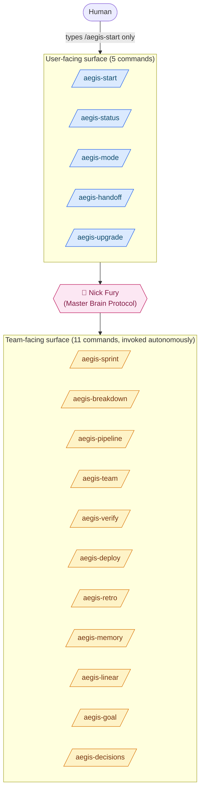
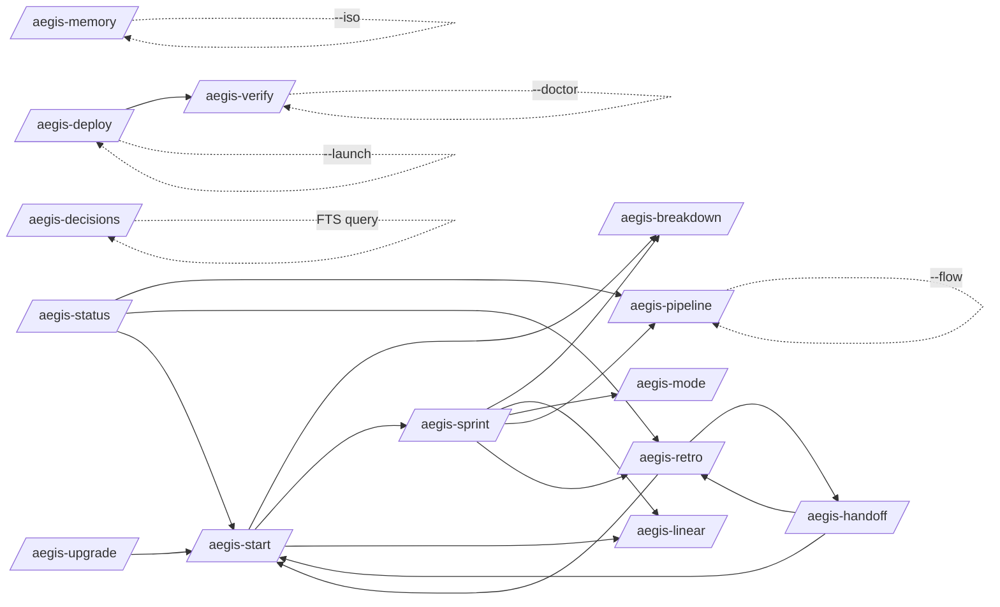
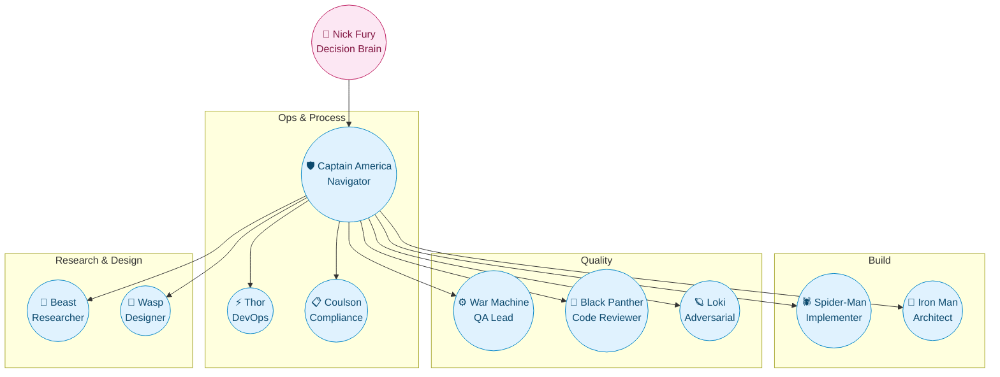
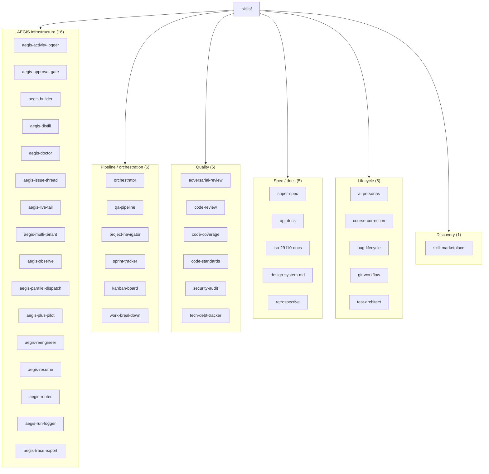
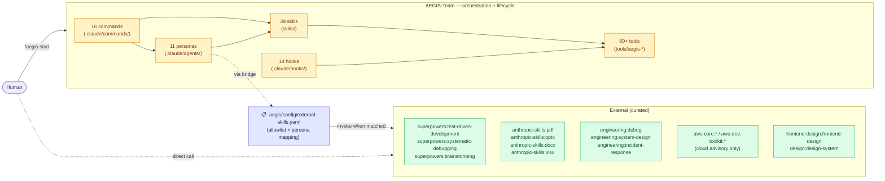
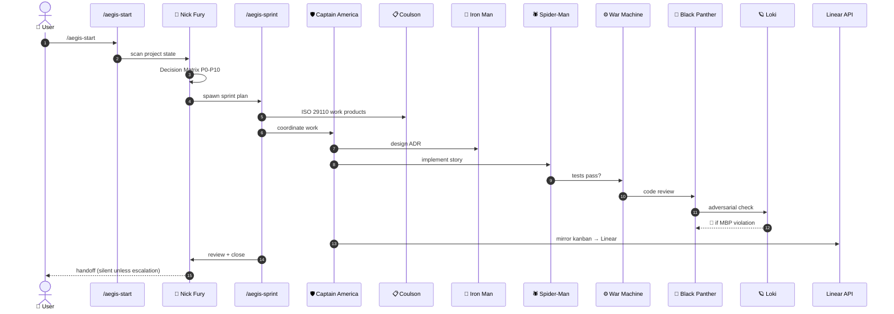

# AEGIS-Team Skill Hierarchy

> Visual reference for the AEGIS v15.0 framework: commands, skills, personas,
> delegation chains, and where external skills sit relative to the
> AEGIS-owned surface.
>
> Generated: 2026-05-14

## Legend

- **Solid edge** (`──►`): in-process delegation (the parent command runs the child)
- **Dotted edge** (`-.->`): conceptual / mode-flag invocation (same command, different subcommand)
- **Persona box**: agent dispatched via the Agent tool
- **External cluster**: skills that exist in the Claude Code session but are NOT chained from AEGIS internals

## 1. Top-level surface

## 2. Command delegation graph

Every internal call between canonical commands. Sub-modes (e.g. `--qa`, `--launch`) are shown as dotted edges back into the same command.

## 3. Personas (Agent tool dispatch)

AEGIS spawns these via the `Agent` tool. Each persona owns specific skills.

## 4. Skills inventory (39 files in `skills/`)

## 5. Boundary: AEGIS-owned vs external skills (selective integration)

**Current state (v15.0):** AEGIS is self-contained as a matter of *fact*
— `grep` across `.claude/commands/` + `skills/` for `superpowers:*`,
`anthropic-skills:*`, etc. returns zero matches. **But this is not the
target state.** AEGIS *should* selectively bridge to external skills for
domain expertise that AEGIS shouldn't reinvent (TDD discipline, PDF
generation, design system tooling, cloud-vendor knowledge, …).

**Target model: selective integration via curated allowlist.**

### Integration policy

| Layer | Rule |
|---|---|
| **AEGIS owns** | Lifecycle, MBP discipline, sprint ceremony, ISO 29110 work products, audit trail, multi-tenant registry, persona dispatch, decision logging |
| **External owns** | Domain knowledge AEGIS can't credibly own — TDD methodology, PDF/PPT generation, AWS service catalog, design systems, marketing copy, …  |
| **Bridge** | `.aegis/config/external-skills.yaml` — curated allowlist mapping `<persona>` × `<task-pattern>` → blessed external skill |
| **Quality bar** | An external skill enters the allowlist only after Loki adversarial review + a written rationale ("AEGIS owns lifecycle of X, delegates execution to Y"). Logged as ADR. |
| **Lockfile** | Each blessed external skill pins a version/checksum so upstream churn doesn't silently change AEGIS behavior |
| **Boundary lint** | Test rejects references to external skills NOT in the allowlist. Boundary is enforced *and* permissive — opposite of "no-cross". |

### Why this matters (the "duplicate-vs-delegate" tradeoff)

Without selective integration, AEGIS faces a choice every time it hits a
domain skill it lacks:

- **Duplicate** (build its own TDD skill that pales next to `superpowers:tdd`) → tech debt grows
- **Block** (refuse the work) → user loses, switches tools
- **Selectively bridge** (delegate execution, keep orchestration) → AEGIS adds value as the conductor without trying to be every instrument

The third path is what the `skill-marketplace` skill hinted at (discovery)
but never followed through (no chaining). v15-11 series should close that
gap.

## 6. End-to-end flow: typical sprint lifecycle

What actually happens when a human types `/aegis-start` and lets the team
run autonomously through a full sprint:

## 7. Where each category lives on disk

| Surface | Location | Count |
|---|---|---|
| Commands | `.claude/commands/aegis-*.md` | 16 |
| Skills | `skills/*.md` | 39 |
| Personas | `.claude/agents/*.md` | 11 |
| Hooks | `.claude/hooks/*.sh` + `.claude/hooks/lib/*.sh` | 14 |
| Tools | `tools/aegis-*` (binaries + scripts) | 60+ |
| Brain | `.aegis/brain/{resonance,instincts,sprints,...}` | living |
| Audit | `.aegis/brain/logs/decision-audit.log` (JSONL) | append-only |

## 8. Recent additions (v15-08/09/10, 2026-05-14)

- **v15-08 terminalSequence** — new helper [tools/aegis-notify.sh](../tools/aegis-notify.sh)
  wired into on-stop, session-start, and linear-sync hooks. Opt-in via
  `AEGIS_HOOK_NOTIFY=1`.
- **v15-09 approval-gate schema** — [check.mjs](../tools/aegis-approval-gate/check.mjs)
  now emits CC 2.1.141's `hookSpecificOutput.{hookEventName,permissionDecision,permissionDecisionReason}`
  on block (strictly additive; `AEGIS_APPROVAL_GATE_SCHEMA=legacy` opts back).
- **v15-10 multi-tenant `--cwd`** — [mt.mjs](../tools/aegis-multi-tenant/mt.mjs)
  gains `cwd <name>` + `run <name> [--dry-run] [-- args]` for CC 2.1.141
  `claude --cwd` integration.

Suite: 58/58 PASS. Roadmap v15 net: 30pt (delivered 10pt this batch).

## 9. External skill catalog — proposed allowlist (v15-11 candidate)

Mapping of high-value external skills to the AEGIS lifecycle stage where
they'd plug in. **Status legend**:
- `proposed` — Loki review pending; not yet in allowlist
- `blessed` — passed adversarial review + ADR logged
- `deferred` — reviewed but excluded with reason

### Build phase (Spider-Man / Iron Man own this stage)

| External skill | AEGIS hook point | Why | Status |
|---|---|---|---|
| `superpowers:test-driven-development` | Spider-Man calls before writing implementation | Mature TDD discipline AEGIS shouldn't reinvent | proposed |
| `superpowers:systematic-debugging` | War Machine on test failure | Methodology for root-cause vs symptom | proposed |
| `superpowers:brainstorming` | Iron Man before ADR | Structured exploration before deciding | proposed |
| `superpowers:writing-plans` | Iron Man / Captain America for multi-step tasks | Plan template + checkpoints | proposed |
| `superpowers:using-git-worktrees` | Thor for parallel branch work | Avoids stash/conflict overhead | proposed |
| `engineering:system-design` | Iron Man for ADR | Battle-tested system design templates | proposed |

### Quality phase (War Machine / Black Panther / Loki own)

| External skill | AEGIS hook point | Why | Status |
|---|---|---|---|
| `engineering:debug` | War Machine on regression | Complements `superpowers:systematic-debugging` | proposed |
| `engineering:code-review` | Black Panther's review pass | Different lens than AEGIS-native `code-review` | proposed |
| `superpowers:verification-before-completion` | War Machine pre-merge gate | Forces explicit verification step | proposed |

### Docs phase (Coulson owns ISO; Beast/Wasp own visuals)

| External skill | AEGIS hook point | Why | Status |
|---|---|---|---|
| `anthropic-skills:pdf` | Coulson for ISO export | PDF generation AEGIS shouldn't own | proposed |
| `anthropic-skills:pptx` | Beast for stakeholder decks | Same — leverage, don't build | proposed |
| `anthropic-skills:docx` | Coulson for SoW / contract drafts | Word interop with non-tech stakeholders | proposed |
| `anthropic-skills:xlsx` | Beast for data tables / pivot work | Spreadsheet ops | proposed |
| `anthropic-skills:canvas-design` | Wasp for layout mockups | Wasp-native; bridges to design tools | proposed |
| `frontend-design:frontend-design` | Wasp for UI design pattern | Frontend-specific guidance | proposed |
| `design:design-system` | Wasp for design system work | Design system patterns | proposed |
| `api-docs` (AEGIS-native) → `anthropic-skills:pdf` | API docs export | Chain native generator → external formatter | proposed |

### Ops / Cloud phase (Thor owns; advisory only)

| External skill | AEGIS hook point | Why | Status |
|---|---|---|---|
| `aws-core:aws-cdk` | Thor for IaC review | AWS-specific patterns | proposed |
| `aws-core:aws-iam` | Coulson for compliance check | IAM policy review | proposed |
| `aws-dev-toolkit:well-architected` | Loki adversarial review (cloud workloads) | WAF heuristics AEGIS doesn't own | proposed |
| `aws-dev-toolkit:cost-check` | Thor pre-deploy gate | Cost regression detection | proposed |
| `engineering:incident-response` | Thor on prod issues | Runbook template | proposed |

### Strategy / Discovery (Nick Fury / Beast)

| External skill | AEGIS hook point | Why | Status |
|---|---|---|---|
| `super-spec` (AEGIS-native) ↔ external research skills | Beast research delegation | AEGIS owns spec output, external owns inputs | already-native |
| `claude-md-management:revise-claude-md` | Captain America at session retro | External meta-tool for CLAUDE.md grooming | proposed |
| `update-config` | Thor for harness changes | Maintains CC settings.json safely | proposed |

### Explicitly **deferred** (reviewed, excluded)

| External skill | Reason for exclusion |
|---|---|
| `paperclip:*` | Different orchestration model (Paperclip is its own control plane); would conflict with AEGIS lifecycle |
| `ralph-loop:*` | Overlaps with `/aegis-goal` HYBRID; pick one substrate |
| `common-room:*`, `windsor-ai:*` | Business-data tools — out of AEGIS scope unless user opts in per-project |
| `claude-seo:*` | Domain-specific (SEO); not part of generic SDLC |
| `aws-amplify:*`, `oracle-*:*` | Single-vendor — keep as user-direct invocation, not AEGIS auto-chain |

### Acceptance criteria for "blessed" status

A `proposed` entry promotes to `blessed` only when:

1. **Loki adversarial review** documented in `.aegis/brain/resonance/external-skill-bridges.md`
2. **ADR logged** explaining "AEGIS lifecycle owns X; delegates Y to <skill>"
3. **Allowlist entry** added to `.aegis/config/external-skills.yaml` with:
   - `skill: superpowers:test-driven-development`
   - `personas: [spider-man]`
   - `triggers: ["new test", "TDD", "test-first"]`
   - `version_pin: <commit-hash-or-version>`
   - `rationale: "<link to ADR>"`
4. **Boundary test updated** — lint allows this skill reference; rejects non-allowlisted ones
5. **Integration test** — at least one persona uses the skill in a happy-path scenario

## 10. v15-11 series plan (proposed)

Implementation work to operationalize §5 + §9:

| Sprint | Points | Deliverable |
|---|---|---|
| v15-11A — Allowlist file format + lint | 3 | `external-skills.yaml` schema, parser, validator test |
| v15-11B — First bridge: TDD | 3 | Spider-Man → `superpowers:test-driven-development` (1 bridge end-to-end as reference impl) |
| v15-11C — Docs phase bridges | 5 | `anthropic-skills:pdf/pptx/docx/xlsx` mapped to Coulson/Beast |
| v15-11D — Build phase bridges | 5 | Remaining `superpowers:*` + `engineering:*` |
| v15-11E — Boundary lint refactor | 2 | Reverse G3 — lint enforces allowlist (not deny-all) |
| **Series total** | **18pt** | Bridge model operational + 10+ blessed external skills |

This **reverses G3** from the gap analysis: the boundary is no longer
"reject all external" but "allowlist-controlled bridge". Loki review +
ADR + version pin make it auditable.
