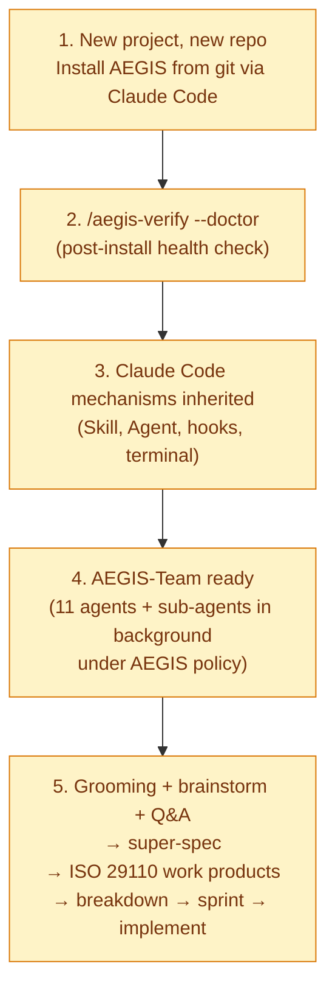
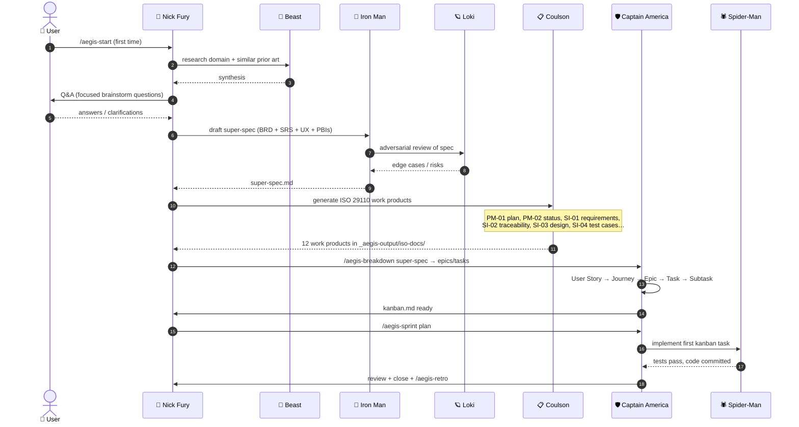

# AEGIS Canonical User Journey

> The end-to-end happy path from "new project, no AEGIS" → "team in full
> ISO 29110 implementation flow." This is the **strategy** AEGIS targets.
> Each step links to where it's implemented and flags any remaining rough
> edges.

Last updated: 2026-05-18

## The 5-step journey



## Step 1 — New project, new repo, install from git via Claude Code

**Goal:** zero-to-installed in one command. No local AEGIS-Team checkout
required.

```bash
cd ~/Documents
bash <(curl -sL https://raw.githubusercontent.com/phariyawitjiap-aeternix/AEGIS-Team/main/install-remote.sh) \
    --new my-project
```

What this does in one shot:
1. Creates `./my-project/` (auto)
2. `git init` (auto)
3. Title-cases slug → PROJECT_NAME for branding
4. Downloads AEGIS framework (16 commands + 36 skills + 11 personas + 14 hooks + 60+ tools)
5. Bootstraps Linear (if token auto-detected — keychain / `LINEAR_API_KEY` / dotfile)
6. Registers in multi-tenant registry (`mt run my-project` works from anywhere)
7. Runs `aegis-doctor` post-install verification

**Status:** ✅ shipped in PR #177 (`install-remote.sh --new` flag).
**Implementation:** [`install-remote.sh`](../install-remote.sh) lines 80–110.

## Step 2 — `/aegis-verify --doctor`

**Goal:** confirm the install is wired correctly — every hook, every
settings.json reference, every tool the framework expects, exists on
disk and is executable.

```bash
# In Claude Code, after install:
> /aegis-verify --doctor
```

Or from the shell:

```bash
bash tools/aegis-doctor.sh .
bash tools/aegis-doctor.sh . --fix    # auto-repair from sibling AEGIS-Team
bash tools/aegis-doctor.sh . --json   # machine-readable
```

What doctor checks:
- `.claude/hooks/*.sh` — every `source`, `node`, `bash` path argument exists
- `.claude/settings.json` — every command's path reference exists
- `.claude/hooks/lib/*.sh` — recursive scan
- Sibling files in tool subdirs (PR #171 — catches the Auto-Affi class
  where copying one .mjs without its peers causes ERR_MODULE_NOT_FOUND)

**Status:** ✅ shipped. Auto-runs at end of `install-remote.sh`.
**Implementation:** [`tools/aegis-doctor.sh`](../tools/aegis-doctor.sh).

## Step 3 — Claude Code mechanisms inherited by AEGIS

**Principle:** AEGIS doesn't fight Claude Code. It composes the native
primitives into an opinionated org-chart.

| Claude Code primitive | AEGIS use |
|---|---|
| **Skill tool** | Each `skills/*.md` is a callable surface (39 skills via Skill tool) |
| **Agent tool** | 11 personas dispatched via `Agent` tool with `subagent_type` |
| **PreToolUse hooks** | MBP guard (no menus), approval-gate (Bash + file ops), guard-write |
| **PostToolUse hooks** | Activity logger, live-tail emitter, Linear-sync trigger, brain-graph rebuild |
| **Stop hooks** | MBP scan, false-ready guard, retro reminder, queue banner, terminalSequence ping |
| **SessionStart hooks** | Brain validate + sync, version drift check, sprint-plan gate banner |
| **Terminal session** | `claude --cwd <path>` for multi-tenant project switching (CC 2.1.141) |
| **JSON hook output** | Approval-gate emits `hookSpecificOutput.permissionDecision` for attributed dialogs (CC 2.1.141) |

**Status:** ✅ intrinsic — every recent CC release has been adopted
(v15-08 terminalSequence, v15-09 approval-gate schema, v15-10 `--cwd`).
**Implementation:** [`.claude/hooks/`](../.claude/hooks/) + [`.claude/settings.json`](../.claude/settings.json).

## Step 4 — AEGIS-Team ready (agents + sub-agents under AEGIS policy)

**What "ready" means:**

```mermaid
flowchart LR
    Human([Human])
    NickFury("🧬 Nick Fury<br/>Decision Brain")
    Cap("🛡 Captain America<br/>Navigator")
    subgraph Agents["11 Marvel personas"]
        IronMan("🦾 Iron Man")
        Spider("🕷 Spider-Man")
        War("⚙ War Machine")
        BP("🐆 Black Panther")
        Loki("🪐 Loki")
        Thor("⚡ Thor")
        Coulson("📋 Coulson")
        Beast("🔬 Beast")
        Wasp("🐝 Wasp")
    end
    Policy["AEGIS policy<br/>· MBP Golden Rule #7<br/>· Approval-gate<br/>· ISO 29110 ceremony<br/>· Decision audit log"]

    Human -->|/aegis-start| NickFury
    NickFury -->|coordinates| Cap
    Cap -->|spawns| Agents
    Agents -.->|every action| Policy
    Policy -.->|enforces| Agents

    classDef brain fill:#fce7f3,stroke:#be185d
    classDef policy fill:#fee2e2,stroke:#dc2626
    class NickFury brain
    class Policy policy
```



**Active discipline (always-on):**
- **No option-menus to human** — Nick Fury decides, doesn't ask A/B/C
- **Approval-gate** — destructive ops blocked unless approved (rule:rm-rf, force-push, drop-table)
- **Decision audit** — every non-trivial decision JSONL-logged with FTS5 search
- **MBP scan** — every assistant response scanned for the option-menu pattern at session-stop
- **False-ready guard** — Nick Fury can't claim "done" if agents are still running
- **Hooks fail-graceful** — if a lib file is missing, hook warns but doesn't crash the session

**Status:** ✅ shipped across v9–v15. The bedrock.
**Implementation:** [`.claude/agents/`](../.claude/agents/) + [`CLAUDE.md`](../CLAUDE.md) Golden Rules.

## Step 5 — Grooming → super-spec → ISO 29110 → breakdown → implement

The flow from "idea" to "code". This is what `/aegis-start` initiates
when there's no existing sprint.



**Skills/commands involved:**

| Stage | Surface | Output |
|---|---|---|
| Research + Q&A | `Beast` persona + `super-spec` skill | Discovery synthesis, focused Q&A |
| Super-spec | `super-spec` skill | BRD + SRS + UX Blueprint + PBIs (4 docs) |
| Adversarial review | `Loki` persona + `adversarial-review` skill | Spec hardening |
| ISO 29110 docs | `Coulson` persona + `iso-29110-docs` skill | 12 work products in `_aegis-output/iso-docs/` |
| Breakdown | `/aegis-breakdown` command + `work-breakdown` skill | User Story → Subtask hierarchy in kanban.md |
| Sprint init | `/aegis-sprint plan` | `.aegis/brain/sprints/sprint-X-Y/{plan,kanban}.md` |
| Implement | `Spider-Man` + `sprint-tracker` + `code-review` + `test-architect` | Code + tests + PR |
| Close | `/aegis-retro` | Retro doc + lessons → brain |

**Status:** ✅ each individual surface exists. The end-to-end orchestration
is choreographed by `/aegis-start` Step 4 (loop substrate per v15-02) +
Nick Fury's Decision Matrix.

**Known rough edges:**
- ⚠ Super-spec → ISO 29110 handoff is implicit (Nick Fury decides when
  to spawn Coulson). v16 candidate: make the chain explicit.
- ⚠ External skill bridges (TDD discipline, PDF export for stakeholder
  decks) are still in v15-11 plan, not yet shipped.
- ⚠ Step 5 has no single "rehearsal" test that walks the entire flow
  end-to-end. Each stage tests independently but the chain isn't
  integration-tested.

## Where this journey lives in code

| Step | Code path | Doc |
|---|---|---|
| 1. Install | [`install-remote.sh`](../install-remote.sh) | [README §Install](../README.md) |
| 2. Doctor | [`tools/aegis-doctor.sh`](../tools/aegis-doctor.sh) | [skills/aegis-doctor removed; tool is canonical] |
| 3. CC primitives | [`.claude/settings.json`](../.claude/settings.json) | [AEGIS_SKILL_HIERARCHY §3](AEGIS_SKILL_HIERARCHY.md) |
| 4. Agents + policy | [`.claude/agents/`](../.claude/agents/) + [`CLAUDE.md`](../CLAUDE.md) | [Golden Rules in CLAUDE.md](../CLAUDE.md) |
| 5. The flow | [`.claude/commands/aegis-start.md`](../.claude/commands/aegis-start.md) | [AEGIS_SKILL_HIERARCHY §6 sprint lifecycle](AEGIS_SKILL_HIERARCHY.md) |

## Anti-patterns (what NOT to do)

- ❌ **Skip /aegis-doctor** — silent missing-deps surface as "ERR_MODULE_NOT_FOUND" mid-session
- ❌ **Edit kanban.md directly** instead of running `/aegis-sprint plan` — skips ISO 29110 ceremony (v15-07 hardened this)
- ❌ **Ask the human option menus** — MBP Golden Rule #7 violation; Nick Fury decides
- ❌ **Cross the boundary without an entry in [`AEGIS_SKILL_HIERARCHY §9`](AEGIS_SKILL_HIERARCHY.md)** — external skills require Loki review + ADR + allowlist (v15-11 plan)
- ❌ **Run `git push --force` or `rm -rf` without an approval grant** — approval-gate blocks; bypass requires `tools/aegis-approval-gate/grant.mjs`

## TL;DR

```bash
# Step 1
cd ~/Documents
bash <(curl -sL https://raw.githubusercontent.com/phariyawitjiap-aeternix/AEGIS-Team/main/install-remote.sh) \
    --new my-project
cd my-project

# Steps 2–5 happen inside Claude Code:
claude
> /aegis-start
# Nick Fury takes over. Steps 2 (doctor), 3 (CC inheritance), 4 (agents
# ready), 5 (grooming → super-spec → ISO → implement) happen
# autonomously. Human watches, doesn't drive.
```
