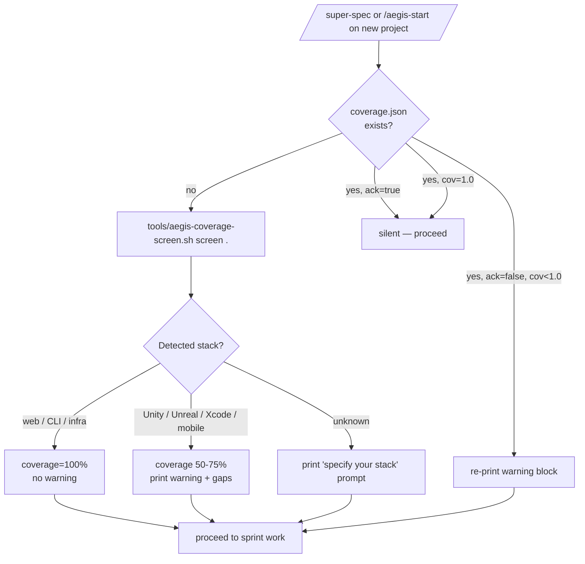

## Why this exists

User crystallized the rule 2026-05-21 after Contra-Thai post-mortem:

> "AEGIS contract = 100% autonomous execution. Human ONLY does (1) requirements + (2) credentials. AEGIS MUST warn user about ANY project < 100% coverage — list every gap, not just big ones. Mandatory even at 99%."

Before this skill, AEGIS would silently take on projects it couldn't drive end-to-end (e.g. Unity → can't press Build → 3 sprints at "100% velocity" produced zero playable artifact). This skill operationalizes the warning so that limitation is surfaced on day 1, not discovered at sprint 3.

## When this skill runs

1. **`/super-spec` Phase 0** — BEFORE the human-interview Q&A. The tool detects the stack from the project's existing files (or asks the human if `unknown`). The warning block is emitted. The screen result lives at `.aegis/brain/state/coverage.json`.
2. **`/aegis-start`** — Every session start. If `coverage.json` exists with `coverage < 1.0 AND ack != true`, re-print the warning as a reminder. The user can type `ack gaps` to silence.
3. **Manual** — Any agent can call `bash tools/aegis-coverage-screen.sh screen .` to re-run the screen (useful after a stack swap).

## Gate semantics — SOFT

- Process always exits 0
- No `permissionDecision: "deny"` JSON output
- Work continues uninterrupted even if user ignores the warning
- The persistent re-surface (every `/aegis-start`) is the forcing function, not the gate

User chose soft gate 2026-05-21 over hard ack. If soft proves insufficient (future Loki finding), upgrade in v15-20+.

## Workflow



## Coverage rubric (excerpt — full table in `tools/aegis-coverage-screen.sh:coverage_for_stack()`)

| Stack | Coverage | Why |
|---|---|---|
| `web-next`, `web-vite`, `web-static`, `cli-node`, `rust`, `go`, `python-*` | 100% | AEGIS can author, test, build, deploy headlessly |
| `terraform`, `cdk`, `pulumi`, `dockerfile-only` | 95% | Credentials/registry login = human one-time |
| `godot-cli` | 95% | CLI buildable; only gap is playtesting (taste) |
| `gradle-android` | 75% | CLI build works but real-device test + keystore + Play Store = human |
| `flutter`, `react-native` | 70% | Headless test works; real-device UX + store submission = human |
| `godot-editor` | 70% | C# needs Editor rebuild + playtest |
| `unity` | 60% | Editor for Build + scene assembly + playtest + art-gen approval |
| `xcode-ios` | 55% | Xcode UI + Apple ID + signing + App Store submission |
| `unreal` | 50% | Editor for everything binary; Blueprint visual scripting |
| `unknown` | 0% | Cannot estimate; prompt user to declare |

## Integration with `/super-spec`

Add as **Phase 0** before Phase 1 (Human Interview):

```markdown
### Phase 0: Tool-Boundary Screen (NEW v15-19)

**Run before any human Q&A.** AEGIS detects the project's stack and emits a
coverage warning if anything is less than 100%.

bash tools/aegis-coverage-screen.sh screen .

If the warning shows gaps:
- Embed the entire warning block in the chat reply
- Wait for user response (typically: "ack gaps", "swap stack to X", or "skip aegis")
- Soft gate — proceed even without explicit response, but coverage.json
  records that gaps remain un-acked, and /aegis-start will re-surface

Only after Phase 0 → continue to Phase 1 (Human Interview).
```

## Integration with `/aegis-start`

Add to the session-start checks (early, before sprint dispatch):

```bash
# v15-19: re-surface coverage warning if unack'd
COVERAGE_JSON=".aegis/brain/state/coverage.json"
if [[ -f "$COVERAGE_JSON" ]]; then
    coverage=$(jq -r '.coverage' "$COVERAGE_JSON" 2>/dev/null || echo "1.0")
    ack=$(jq -r '.ack' "$COVERAGE_JSON" 2>/dev/null || echo "true")
    if [[ "$ack" != "true" ]] && [[ $(awk "BEGIN { print ($coverage < 1.0) }") == "1" ]]; then
        bash tools/aegis-coverage-screen.sh show .
    fi
fi
```

## User-visible commands

| Command | Effect |
|---|---|
| (automatic) | Runs at `/super-spec` Phase 0 and `/aegis-start` if unack'd |
| `bash tools/aegis-coverage-screen.sh detect .` | Print just the detected stack |
| `bash tools/aegis-coverage-screen.sh screen .` | Run the screen + write coverage.json |
| `bash tools/aegis-coverage-screen.sh show .` | Re-print the warning from existing coverage.json |
| `bash tools/aegis-coverage-screen.sh ack .` | Mark gaps acknowledged (silence re-surface) |
| `bash tools/aegis-coverage-screen.sh list-stacks` | Show all known stacks + their coverage |
| (user) "ack gaps" | Conversational equivalent of the ack command |

## Schema: `coverage.json`

```json
{
  "schema": "aegis-coverage-v1",
  "stack": "unity",
  "coverage": 0.60,
  "coverage_pct": 60,
  "ack": false,
  "screened_at": "2026-05-21T03:00:00Z",
  "acked_at": null,
  "gaps": [
    {
      "id": "GAP_UNITY_EDITOR",
      "action_th": "เปิดโปรแกรม Unity แล้วกดปุ่ม Build ...",
      "action_en": "Open Unity Editor and press Build ...",
      "frequency": "every sprint"
    }
  ],
  "swap_recommendation": "..."
}
```

## Linked memory

- [[aegis-coverage-contract]] — the originating user feedback
- [[plain-thai-voice]] — warning block uses plain Thai not dev-Thai
- [[policy-without-test]] — this skill closes the bug class (rule had no enforcement before v15-19)
