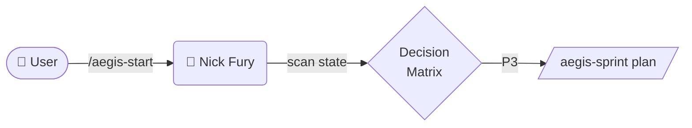

# Diagram-First Reflex

## Quick Reference

When you (any AEGIS persona) are about to explain something **structural**, output a Mermaid diagram BEFORE the prose. The diagram is the spine; the prose is the muscle.

This is a **reflex**, not breathing — it fires on trigger, not every turn.

## Trigger / Anti-trigger matrix

| Trigger (USE mermaid) | Diagram type | Example |
|---|---|---|
| Flow with > 3 ordered steps | `flowchart TB` | "first do A, then B, then if X do C else D, then E" |
| Decision with > 2 branches | `flowchart` with diamond | Nick Fury's Decision Matrix P0-P10 |
| Multi-actor interaction | `sequenceDiagram` | Captain America dispatches Iron Man + Spider-Man + War Machine |
| State machine | `stateDiagram-v2` | Sprint kanban (TODO → IN_PROGRESS → IN_REVIEW → DONE) |
| Hierarchy / tree with > 5 nodes | `flowchart TB` | Skill catalog, persona org-chart |
| Dependencies / timeline | `gantt` or `flowchart LR` | Sprint dependency map |

| Anti-trigger (USE prose) | Why |
|---|---|
| Single fact or linear answer | Diagram adds 30+ tokens for zero clarity gain |
| RFC / retro / post-mortem analysis | "Why" needs sentences, not boxes |
| Code review feedback | Use prose + code snippet — diagrams obscure line-level issues |
| Apology / correction / acknowledgment | Prose only — diagrams feel cold |
| 1-2 step instruction | Use numbered list, not flowchart |
| Pure data table | Use Markdown table |

## Per-persona defaults

Each persona has a "default diagram type" — what they reach for first when in trigger condition:

| Persona | Default diagram | Why |
|---|---|---|
| 🧬 **Nick Fury** | `flowchart TB` with decision diamonds | Decision Matrix is his job |
| 🛡 **Captain America** | `sequenceDiagram` | Coordinator — shows who dispatches what |
| 🦾 **Iron Man** | `flowchart TB` (architecture) + `stateDiagram-v2` (lifecycle) | Architect — system maps |
| 🪐 **Loki** | `flowchart TB` with red ⚠ nodes | Adversarial — shows attack paths + edge cases |
| 📋 **Coulson** | `flowchart LR` (traceability) + tables | Compliance — req → impl → test map |
| 🕷 **Spider-Man** | (mostly prose + code) — `sequenceDiagram` for API flows only | Implementer — diagrams when integrating |
| ⚙ **War Machine** | `stateDiagram-v2` (test phases) | QA — state transitions of test runs |
| 🐆 **Black Panther** | (mostly prose + code) — `flowchart` for review trees | Reviewer — comments per finding |
| ⚡ **Thor** | `flowchart LR` (deploy pipeline) + `gantt` (release timeline) | DevOps — pipeline + schedule |
| 🔬 **Beast** | `flowchart TB` (concept maps) | Researcher — synthesis trees |
| 🐝 **Wasp** | (uses image artifacts) — `flowchart` for user journey maps only | Designer — visuals via canvas-design skill |

## Style rules

1. **Render in Markdown fences** — ` ```mermaid ... ``` `. Renders in **committed markdown only**: GitHub, Linear, Notion, IDE preview, brain-graph wiki. It does **NOT** render in Claude Desktop or VSCode **chat** (see rule 8).
2. **Label every edge** that isn't trivially obvious — use `-->|action|` syntax. Unlabeled edges = lazy thinking.
3. **Name every node descriptively** — no `A`, `B`, `C`. Use `IronMan["🦾 Iron Man<br/>architect"]` style.
4. **Direction matters** — `TB` (top-bottom) for hierarchies, `LR` (left-right) for sequences/pipelines.
5. **Emoji prefixes for persona nodes** — keep visual identity (🧬 Nick, 🛡 Cap, 🦾 Iron, etc.).
6. **Color when meaningful** — `classDef warning fill:#fee2e2,stroke:#dc2626` for hot paths, `classDef brain fill:#fce7f3,stroke:#be185d` for Nick Fury.
7. **Keep mid-density** — 5-15 nodes is the sweet spot. > 20 nodes = split into multiple diagrams (lifecycle, dispatch, state).
8. **Channel guard (v15-28) — chat does NOT render mermaid.** Claude Desktop and VSCode chat show a ```mermaid fence as raw DSL, not a picture (verified 2026-05-25). So this whole reflex applies to content destined for a **renderer** (PRs, kanbans, ADRs, brain wiki, files opened in IDE preview). When the output is a **chat reply**, do NOT lead with a mermaid fence — express the structure as a table + nested list + prose, and (optionally) write the mermaid into a committed file you then link.

## When you find yourself doing this — DON'T

```
"The flow is: first the user types /aegis-start, then Nick Fury scans, then..."
```

→ Replace with:


## When NOT to use (anti-pattern catch)

These are real cases this skill has encountered — DON'T diagram them:

```
❌ "The file is at .claude/agents/nick-fury.md"
   → Just say it. A 1-node diagram is noise.

❌ "I'm sorry I missed that earlier — let me fix it now."
   → Prose. Diagrams here read as cold/robotic.

❌ "Why did the test fail? Looking at line 42, the assertion expects X
   but got Y because Z."
   → Prose + code snippet. The "why" is narrative.
```

## Integration with existing AEGIS skills

- **Compatible with**: `super-spec`, `iso-29110-docs`, `aegis-brain-graph` (Mermaid in Markdown gets indexed normally)
- **Replaces ASCII boxes** in: `Captain America` sprint plans, `Iron Man` ADRs, `Nick Fury` decision logs
- **Does NOT replace**: `canvas-design` for actual visual UI mockups; that's the `Wasp` skill's territory

## Verification (test coverage)

`tests/aegis-diagram-first-lint-test.sh`:
- Scan recent `.aegis/brain/sprints/*/plan.md` and `*/close.md` for the pattern: > 50 lines of prose with ZERO mermaid blocks in a sprint that has multi-agent dispatch, state transitions, or > 3-step flows. Warn (not fail) if missing — diagrams should appear naturally.

## Acceptance for the agent

A persona is "fluent in diagram-first reflex" when:
- They produce > 0 mermaid diagrams per sprint plan they author
- They DON'T diagram anti-trigger content
- Their diagrams have labeled edges + named nodes
- Diagrams render correctly in GitHub preview (no syntax errors)
